# Specyfikacja Techniczna: Moduł Autentykacji i Onboardingu - VibeTravels

**Wersja**: 1.0
**Data**: 2025-10-13
**Status**: Aktualny (dokumentuje istniejącą implementację)

---

## Spis treści

1. [Przegląd architektury](#1-przegląd-architektury)
   - 1.3 [📊 Diagram architektury systemu](#13-diagram-architektury-systemu)
2. [Architektura interfejsu użytkownika](#2-architektura-interfejsu-użytkownika)
3. [Logika backendowa](#3-logika-backendowa)
4. [System autentykacji](#4-system-autentykacji)
5. [Przepływ użytkownika](#5-przepływ-użytkownika)
   - 5.0 [📊 Diagram przepływu użytkownika](#50-diagram-przepływu-użytkownika)
6. [Baza danych](#6-baza-danych)
   - 6.0 [📊 Diagram struktury bazy danych](#60-diagram-struktury-bazy-danych)
7. [Testowanie](#7-testowanie)
8. [Punkty integracji](#8-punkty-integracji)

---

## 1. Przegląd architektury

### 1.1 Stack technologiczny

VibeTravels wykorzystuje następujący stack do implementacji modułu autentykacji i onboardingu:

- **Backend Framework**: Laravel 11
- **Autentykacja**: Laravel Breeze (Livewire + Volt variant)
- **OAuth**: Laravel Socialite (Google OAuth 2.0)
- **Frontend**: Livewire 3 + Volt (single-file components)
- **UI Components**: Wire UI + Alpine.js + Tailwind CSS 4
- **Baza danych**: MySQL 8
- **Email**: Laravel Mail + MailHog (dev) / Mailgun (prod)
- **Komunikacja**: Server-side rendering przez Livewire (bez REST API)

### 1.2 Kluczowe założenia architektoniczne

1. **Livewire-first approach**: Cała logika autentykacji i onboardingu obsługiwana przez komponenty Livewire. Brak oddzielnego REST API.

2. **Volt single-file components**: Autentykacja używa Volt (Livewire SFC) dla stron auth (`login`, `register`, `forgot-password`, etc.).

3. **Multi-step onboarding**: Wizard 4-krokowy z zapisywaniem postępu w bazie danych.

4. **Google OAuth integration**: Pełna integracja z Google OAuth jako alternatywna metoda rejestracji/logowania.

5. **Email verification required**: Obowiązkowa weryfikacja emaila przed dostępem do pełnej funkcjonalności.

6. **Middleware-based access control**: Ochrona tras przez middleware: `auth`, `verified`, `onboarding.completed`.

### 1.3 Diagram architektury systemu

Poniższy diagram przedstawia architekturę modułu autentykacji i onboardingu z podziałem na warstwy:


**Legenda**:
- **Frontend Layer**: Komponenty Livewire/Volt, UI components
- **Application Layer**: Kontrolery, serwisy, akcje (logika biznesowa)
- **Domain Layer**: Modele Eloquent, relacje
- **Infrastructure Layer**: Baza danych, zewnętrzne serwisy

---

## 2. Architektura interfejsu użytkownika

### 2.1 Struktura komponentów Livewire

#### 2.1.1 Komponenty autentykacji (Volt single-file components)

**Lokalizacja**: `resources/views/livewire/pages/auth/`

Aplikacja używa **Volt** - single-file components Livewire, gdzie logika PHP i widok Blade są w jednym pliku.

| Komponent | Plik | Odpowiedzialność |
|-----------|------|------------------|
| **Register** | `register.blade.php` | Rejestracja email+hasło, walidacja, tworzenie użytkownika |
| **Login** | `login.blade.php` | Logowanie email+hasło, remember me, przekierowania |
| **Forgot Password** | `forgot-password.blade.php` | Wysyłka linku resetującego hasło |
| **Reset Password** | `reset-password.blade.php` | Reset hasła z tokenem |
| **Verify Email** | `verify-email.blade.php` | Ekran przypominający o weryfikacji emaila |
| **Confirm Password** | `confirm-password.blade.php` | Potwierdzenie hasła dla wrażliwych operacji |

**Routing**: Wszystkie komponenty Volt są zarejestrowane w `routes/auth.php` za pomocą `Volt::route()`.

**Przykład routingu**:
```php
// routes/auth.php
Volt::route('register', 'pages.auth.register')->name('register');
Volt::route('login', 'pages.auth.login')->name('login');
```

#### 2.1.2 Komponenty onboardingu

**Lokalizacja**: `app/Livewire/Onboarding/`

| Komponent | Klasa | Odpowiedzialność |
|-----------|-------|------------------|
| **OnboardingWizard** | `App\Livewire\Onboarding\OnboardingWizard` | Główny komponent wizarda 4-krokowego |

**OnboardingWizard** - szczegóły:

- **Lokalizacja klasy**: `app/Livewire/Onboarding/OnboardingWizard.php`
- **Widok**: `resources/views/livewire/onboarding/onboarding-wizard.blade.php`
- **Layout**: `resources/views/layouts/onboarding.blade.php`

**Właściwości publiczne** (reactive state):
```php
public int $currentStep = 1;              // Aktualny krok (1-4)
public string $nickname = '';             // Krok 1: Nickname
public string $homeLocation = '';         // Krok 1: Miasto domowe
public array $interestCategories = [];    // Krok 2: Kategorie zainteresowań (multi-select)
public string $travelPace = '';           // Krok 3: Tempo podróży
public string $budgetLevel = '';          // Krok 3: Budżet
public string $transportPreference = '';  // Krok 3: Transport
public string $restrictions = '';         // Krok 3: Ograniczenia
public bool $isLoading = false;           // Loading state
```

**Metody publiczne** (akcje Livewire):
- `nextStep()` - Walidacja i przejście do następnego kroku
- `previousStep()` - Powrót do poprzedniego kroku
- `completeOnboarding()` - Ukończenie wizarda i przekierowanie
- `toggleInterest(string $category)` - Toggle kategorii zainteresowań
- `setTravelPace(string $pace)` - Ustawienie tempa podróży
- `setBudgetLevel(string $level)` - Ustawienie budżetu
- `setTransportPreference(string $transport)` - Ustawienie transportu
- `setRestrictions(string $restrictions)` - Ustawienie ograniczeń

**Walidacja per krok**:
```php
protected function rulesForStep(int $step): array
{
    return match ($step) {
        1 => [
            'nickname' => 'required|string|max:50',
            'homeLocation' => 'required|string|max:100',
        ],
        2 => [
            'interestCategories' => 'required|array|min:1',
            'interestCategories.*' => 'string|in:...',
        ],
        3 => [
            'travelPace' => 'required|in:spokojne,umiarkowane,intensywne',
            'budgetLevel' => 'required|in:ekonomiczny,standardowy,premium',
            'transportPreference' => 'required|in:pieszo_publiczny,wynajem_auta,mix',
            'restrictions' => 'required|in:brak,dieta,mobilnosc',
        ],
        default => [],
    };
}
```

**Zapisywanie postępu**:
- Dane z każdego kroku są zapisywane do bazy **zaraz po walidacji** w metodzie `saveStepData()`
- Krok 1: zapisuje `nickname`, `home_location`, `onboarding_step = 2` w tabeli `users`
- Krok 2: zapisuje `interests_categories` w tabeli `user_preferences`
- Krok 3: zapisuje `travel_pace`, `budget_level`, `transport_preference`, `restrictions` w `user_preferences`
- Krok 4: wywoływana jest akcja `CompleteOnboardingAction` która ustawia `onboarding_completed = true`, `onboarding_completed_at = now()`

#### 2.1.3 Pozostałe komponenty

| Komponent | Lokalizacja | Odpowiedzialność |
|-----------|-------------|------------------|
| **Logout** | `app/Livewire/Actions/Logout.php` | Akcja wylogowania |
| **Dashboard** | `app/Livewire/Dashboard.php` | Główny dashboard (wymaga ukończonego onboardingu) |
| **Welcome** | `app/Livewire/Welcome.php` | Ekran powitalny po ukończeniu onboardingu |

### 2.2 Blade views i layouty

#### 2.2.1 Struktura layoutów

**Guest layout** (dla niezalogowanych):
- **Plik**: `resources/views/layouts/guest.blade.php`
- **Używany przez**: Strony auth (login, register, forgot-password)
- **Zawiera**: Logo, formularz centralnie, link do alternatywnej akcji

**Authenticated layout** (dla zalogowanych):
- **Plik**: `resources/views/layouts/app.blade.php`
- **Używany przez**: Dashboard, profile, plans
- **Zawiera**: Topbar/sidebar z nawigacją, licznik limitów AI, przycisk wylogowania

**Onboarding layout**:
- **Plik**: `resources/views/layouts/onboarding.blade.php`
- **Używany przez**: OnboardingWizard
- **Zawiera**: Progress indicator (kroki 1-4), minimalistyczny design bez nawigacji

#### 2.2.2 Widoki komponentów

**Onboarding wizard view**:
- **Plik**: `resources/views/livewire/onboarding/onboarding-wizard.blade.php`
- **Struktura**:
  ```blade
  <div>
      <!-- Progress indicator -->
      <div class="steps">...</div>

      <!-- Krok 1: Dane podstawowe -->
      @if($currentStep === 1)
          <form wire:submit.prevent="nextStep">...</form>
      @endif

      <!-- Krok 2: Kategorie zainteresowań -->
      @if($currentStep === 2)
          <div>...</div>
      @endif

      <!-- Krok 3: Parametry praktyczne -->
      @if($currentStep === 3)
          <div>...</div>
      @endif

      <!-- Krok 4: Podsumowanie -->
      @if($currentStep === 4)
          <div wire:click="completeOnboarding">...</div>
      @endif
  </div>
  ```

### 2.3 Wykorzystanie Wire UI components

Wire UI jest używane w całej aplikacji dla spójnego designu:

- **Buttons**: `<x-button>`, `<x-button.primary>`, `<x-button.secondary>`
- **Inputs**: `<x-input>`, `<x-inputs.password>`
- **Checkboxes**: `<x-checkbox>` (dla kategorii zainteresowań)
- **Radio buttons**: `<x-radio>` (dla parametrów praktycznych)
- **Notifications**: `<x-notification>` (komunikaty sukcesu/błędu)
- **Modals**: `<x-modal>` (dla potwierdzenia usunięcia konta)

**Przykład użycia w onboardingu**:
```blade
<!-- Krok 1: Nickname input -->
<x-input
    wire:model.live="nickname"
    label="Twój nickname"
    placeholder="Jak mamy się do Ciebie zwracać?"
    error="{{ $errors->first('nickname') }}"
/>

<!-- Krok 2: Multi-select interests -->
@foreach($availableInterests as $key => $label)
    <x-checkbox
        wire:click="toggleInterest('{{ $key }}')"
        :checked="isInterestSelected('{{ $key }}')"
        label="{{ $label }}"
    />
@endforeach
```

### 2.4 Interakcje Alpine.js

Alpine.js jest używane **minimalnie** tylko do drobnych UI interactions:

**Przykłady zastosowań**:

1. **Toggle collapsed sections**:
   ```blade
   <div x-data="{ open: false }">
       <button @click="open = !open">Show assumptions</button>
       <div x-show="open" x-collapse>...</div>
   </div>
   ```

2. **Loading state dla przycisków**:
   ```blade
   <button
       wire:click="completeOnboarding"
       wire:loading.attr="disabled"
       wire:loading.class="opacity-50"
   >
       <span wire:loading.remove>Zakończ</span>
       <span wire:loading>Zapisywanie...</span>
   </button>
   ```

3. **Local state dla dropdownów**:
   ```blade
   <div x-data="{ dropdown: false }">
       <button @click="dropdown = !dropdown">Menu</button>
       <div x-show="dropdown" @click.outside="dropdown = false">...</div>
   </div>
   ```

**Zasada**: Livewire = logika biznesowa + backend state, Alpine.js = drobne UI interactions.

### 2.5 Walidacja i komunikaty błędów

#### 2.5.1 Walidacja real-time

**Implementacja**:
- Komponenty Volt/Livewire używają **inline validation** w metodach akcji
- Walidacja jest wywoływana w `nextStep()` przez `$this->validate()`
- Błędy są automatycznie dostępne w widoku przez `$errors`

**Przykład walidacji w OnboardingWizard**:
```php
public function nextStep(): void
{
    $this->validate($this->rulesForStep($this->currentStep), $this->messages());
    $this->saveStepData();
    $this->currentStep++;
}
```

**Wyświetlanie błędów w Blade**:
```blade
<x-input wire:model="nickname" label="Nickname" />
@error('nickname')
    <span class="text-red-500 text-sm">{{ $message }}</span>
@enderror
```

Wire UI automatycznie obsługuje wyświetlanie błędów przez atrybut `error`:
```blade
<x-input wire:model="nickname" error="{{ $errors->first('nickname') }}" />
```

#### 2.5.2 Komunikaty sukcesu

**Session flash messages**:
```php
// W kontrolerze/akcji
session()->flash('success', 'Profil został pomyślnie skonfigurowany!');

// W widoku
@if(session('success'))
    <x-notification type="success">{{ session('success') }}</x-notification>
@endif
```

**Livewire notifications** (Wire UI):
```php
// W komponencie Livewire
$this->notification()->success('Dane zapisane!');
```

### 2.6 Routing i nawigacja

#### 2.6.1 Struktura routes

**routes/auth.php** (Laravel Breeze routes):
```php
// Guest routes
Route::middleware('guest')->group(function () {
    Volt::route('register', 'pages.auth.register')->name('register');
    Volt::route('login', 'pages.auth.login')->name('login');
    Volt::route('forgot-password', 'pages.auth.forgot-password')->name('password.request');
    Volt::route('reset-password/{token}', 'pages.auth.reset-password')->name('password.reset');
});

// Authenticated routes (email verification)
Route::middleware('auth')->group(function () {
    Volt::route('verify-email', 'pages.auth.verify-email')->name('verification.notice');
    Route::get('verify-email/{id}/{hash}', VerifyEmailController::class)
        ->middleware(['signed', 'throttle:6,1'])
        ->name('verification.verify');
    Volt::route('confirm-password', 'pages.auth.confirm-password')->name('password.confirm');
});
```

**routes/web.php** (Main app routes):
```php
// Public
Route::view('/', 'welcome')->name('home');

// Guest only
Route::middleware('guest')->group(function () {
    Route::get('/auth/google', [OAuthController::class, 'redirectToGoogle'])->name('auth.google');
    Route::get('/auth/google/callback', [OAuthController::class, 'handleGoogleCallback'])->name('auth.google.callback');
});

// Authenticated + verified
Route::middleware(['auth', 'verified'])->group(function () {
    Route::view('profile', 'profile')->name('profile');
    Route::get('onboarding', OnboardingWizard::class)->name('onboarding');
    Route::get('welcome', Welcome::class)->name('welcome');
});

// Authenticated + verified + onboarding completed
Route::middleware(['auth', 'verified', 'onboarding.completed'])->group(function () {
    Route::view('dashboard', 'dashboard')->name('dashboard');
    Route::prefix('plans')->name('plans.')->group(function () {
        Route::get('/create', CreatePlanForm::class)->name('create');
        Route::get('/{plan}', Show::class)->name('show');
    });
});
```

#### 2.6.2 Middleware

**Middleware stack dla różnych części aplikacji**:

| Sekcja | Middleware | Efekt |
|--------|-----------|-------|
| Login/Register | `guest` | Tylko dla niezalogowanych |
| Email verification | `auth` | Wymaga logowania |
| Onboarding | `auth`, `verified` | Wymaga logowania + zweryfikowanego emaila |
| Dashboard/Plans | `auth`, `verified`, `onboarding.completed` | Pełny dostęp po ukończeniu onboardingu |
| Profile | `auth` | Dostęp bez weryfikacji (można zweryfikować email z profilu) |

**Custom middleware: EnsureOnboardingCompleted**:
- **Lokalizacja**: `app/Http/Middleware/EnsureOnboardingCompleted.php`
- **Logika**: Sprawdza czy `auth()->user()->hasCompletedOnboarding()`, jeśli nie - redirect do `/onboarding`
- **Rejestracja**: W `bootstrap/app.php` jako middleware alias `onboarding.completed`

#### 2.6.3 Redirects po akcjach

**Po rejestracji email+hasło**:
1. Utworzenie konta → event `Registered` → wysyłka email weryfikacyjny
2. Auto-login
3. Redirect → `/verify-email` (ekran przypominający o weryfikacji)

**Po rejestracji Google OAuth**:
1. Callback → utworzenie/update użytkownika
2. Auto-login
3. Email automatycznie zweryfikowany (`email_verified_at = now()`)
4. Redirect → `/onboarding` (bo `needsOnboarding()` = true)

**Po logowaniu**:
1. Weryfikacja credentials
2. Jeśli `!hasVerifiedEmail()` → redirect `/verify-email`
3. Jeśli `needsOnboarding()` → redirect `/onboarding`
4. W przeciwnym razie → redirect `/dashboard`

**Po ukończeniu onboardingu**:
1. Zapis danych w DB
2. Wysyłka welcome emaila (async przez queue)
3. Redirect → `/welcome` (ekran powitalny)
4. Z welcome screenu przycisk → `/dashboard`

---

## 3. Logika backendowa

### 3.1 Kontrolery i akcje

#### 3.1.1 Architektura kontrolerów

**Filozofia**: VibeTravels używa **hybrydowego podejścia**:

1. **Volt single-file components** dla standardowych stron auth (login, register) - logika w blade files
2. **Dedykowane kontrolery** dla złożonych operacji (OAuth, email verification)
3. **Komponenty Livewire** dla multi-step flows (onboarding)

#### 3.1.2 Kontrolery autentykacji

**OAuthController**:
- **Lokalizacja**: `app/Http/Controllers/Auth/OAuthController.php`
- **Zależności**: `AuthService` (dependency injection)
- **Metody**:
  - `redirectToGoogle()`: Redirect do Google OAuth consent screen
  - `handleGoogleCallback()`: Obsługa callbacku, utworzenie/update użytkownika, login, redirect

**Kod**:
```php
public function handleGoogleCallback(): RedirectResponse
{
    try {
        $googleUser = Socialite::driver('google')->stateless()->user();

        $user = $this->authService->handleGoogleCallback([
            'id' => $googleUser->id,
            'name' => $googleUser->name,
            'email' => $googleUser->email,
            'avatar' => $googleUser->avatar,
        ]);

        // Redirect based on onboarding status
        if ($user->needsOnboarding()) {
            return redirect()->route('onboarding')
                ->with('success', 'Welcome! Please complete your profile setup.');
        }

        return redirect()->route('dashboard')->with('success', 'Welcome back!');

    } catch (\Exception $e) {
        Log::channel('auth')->error('Google OAuth failed', [...]);
        return redirect()->route('register')
            ->with('error', 'Failed to authenticate with Google.');
    }
}
```

**VerifyEmailController**:
- **Lokalizacja**: `app/Http/Controllers/Auth/VerifyEmailController.php`
- **Odpowiedzialność**: Weryfikacja emaila przez link z tokenem
- **Middleware**: `signed`, `throttle:6,1` (ochrona przed bruteforcowaniem)

#### 3.1.3 Akcje (Action classes)

**CompleteOnboardingAction**:
- **Lokalizacja**: `app/Actions/Onboarding/CompleteOnboardingAction.php`
- **Odpowiedzialność**: Atomowa transakcja ukończenia onboardingu
- **Kod**:
```php
public function execute(User $user, array $preferences = []): User
{
    return DB::transaction(function () use ($user, $preferences) {
        if (!empty($preferences)) {
            $user->preferences()->update($preferences);
        }

        $user->update([
            'onboarding_completed' => true,
            'onboarding_completed_at' => now(),
            'onboarding_step' => 4,
        ]);

        return $user->fresh(['preferences']);
    });
}
```

### 3.2 Modele i relacje

#### 3.2.1 Model User

**Lokalizacja**: `app/Models/User.php`

**Traits**:
- `HasApiTokens` (Laravel Sanctum - dla API)
- `HasFactory` (factory support)
- `Notifiable` (email notifications)
- `SoftDeletes` (soft delete support)
- `MustVerifyEmail` (interface - email verification)

**Fillable properties**:
```php
protected $fillable = [
    'name', 'email', 'password',
    'google_id', 'avatar_url',
    'onboarding_completed', 'nickname', 'home_location',
    'onboarding_completed_at', 'onboarding_step',
    'ai_generations_count_current_month', 'ai_generations_reset_at',
];
```

**Casts**:
```php
protected function casts(): array
{
    return [
        'email_verified_at' => 'datetime',
        'password' => 'hashed',
        'onboarding_completed' => 'boolean',
        'onboarding_completed_at' => 'datetime',
        'onboarding_step' => 'integer',
        'ai_generations_count_current_month' => 'integer',
        'ai_generations_reset_at' => 'datetime',
    ];
}
```

**Relacje**:
```php
public function preferences(): HasOne
{
    return $this->hasOne(UserPreference::class);
}

public function travelPlans(): HasMany
{
    return $this->hasMany(TravelPlan::class);
}

public function aiGenerations(): HasMany
{
    return $this->hasMany(AIGeneration::class);
}
```

**Helper methods**:
```php
public function hasCompletedOnboarding(): bool
{
    return $this->onboarding_completed_at !== null;
}

public function needsOnboarding(): bool
{
    return !$this->onboarding_completed;
}

public function isOAuthUser(): bool
{
    return $this->google_id !== null;
}

public function getDisplayNameAttribute(): ?string
{
    return $this->nickname ?? $this->name;
}

public function getRemainingAiGenerations(int $limit = 10): int
{
    return max(0, $limit - $this->ai_generations_count_current_month);
}
```

#### 3.2.2 Model UserPreference

**Lokalizacja**: `app/Models/UserPreference.php`

**Fillable properties**:
```php
protected $fillable = [
    'user_id',
    'language', 'timezone', 'currency',
    'notifications_enabled', 'email_notifications', 'push_notifications',
    'theme',
    'interests_categories',  // JSON array
    'travel_pace',           // ENUM: spokojne|umiarkowane|intensywne
    'budget_level',          // ENUM: ekonomiczny|standardowy|premium
    'transport_preference',  // ENUM: pieszo_publiczny|wynajem_auta|mix
    'restrictions',          // ENUM: brak|dieta|mobilnosc
];
```

**Casts**:
```php
protected $casts = [
    'interests_categories' => 'array',  // JSON → PHP array
    'notifications_enabled' => 'boolean',
    'email_notifications' => 'boolean',
    'push_notifications' => 'boolean',
];
```

**Relacja**:
```php
public function user(): BelongsTo
{
    return $this->belongsTo(User::class);
}
```

**Dostępne kategorie zainteresowań** (stored in JSON as array):
- `historia_kultura`
- `przyroda_outdoor`
- `gastronomia`
- `nocne_zycie`
- `plaze_relaks`
- `sporty_aktywnosci`
- `sztuka_muzea`

### 3.3 Serwisy biznesowe

#### 3.3.1 AuthService

**Lokalizacja**: `app/Services/AuthService.php`

**Odpowiedzialności**:
- Rejestracja użytkownika email+hasło
- Obsługa Google OAuth callback
- Logowanie/wylogowanie
- Reset hasła
- Usunięcie konta (GDPR)

**Metody publiczne**:

1. **registerWithEmail(array $data): User**
   ```php
   public function registerWithEmail(array $data): User
   {
       $user = User::create([
           'name' => $data['name'] ?? 'User',
           'email' => $data['email'],
           'password' => Hash::make($data['password']),
           'onboarding_completed' => false,
       ]);

       event(new Registered($user));
       Auth::login($user);

       return $user;
   }
   ```

2. **handleGoogleCallback(array $googleUser): User**
   - Sprawdza czy użytkownik z tym Google ID lub emailem już istnieje
   - Jeśli istnieje: update `google_id` i `avatar_url`, weryfikacja emaila
   - Jeśli nie istnieje: utworzenie nowego użytkownika z `email_verified_at = now()`
   - Auto-login
   - Return użytkownik

3. **attemptLogin(string $email, string $password, bool $remember): bool**
   ```php
   public function attemptLogin(string $email, string $password, bool $remember = false): bool
   {
       if (Auth::attempt(['email' => $email, 'password' => $password], $remember)) {
           session()->regenerate();
           return true;
       }

       throw ValidationException::withMessages([
           'email' => __('auth.failed'),
       ]);
   }
   ```

4. **logout(): void**
   ```php
   public function logout(): void
   {
       Auth::guard('web')->logout();
       session()->invalidate();
       session()->regenerateToken();
   }
   ```

5. **deleteAccount(User $user): void**
   ```php
   public function deleteAccount(User $user): void
   {
       // Delete related data (cascade handled in model events)
       $user->travelPlans()->delete();
       $user->aiGenerations()->delete();
       $user->preferences()->delete();

       // Hard delete user
       $user->forceDelete();

       $this->logout();
   }
   ```

**GDPR compliance**: `deleteAccount` wykonuje **hard delete** (nie soft delete) z kaskadowym usunięciem wszystkich powiązanych danych.

### 3.4 Walidacja danych

#### 3.4.1 Inline validation vs Form Requests

**Podejście w VibeTravels**: **Inline validation w komponentach Livewire**

**Uzasadnienie**:
- Livewire komponenty mają built-in support dla walidacji
- Form Requests są bardziej odpowiednie dla tradycyjnych kontrolerów
- Inline validation = mniej plików, większa spójność kodu

**Przykład (OnboardingWizard)**:
```php
protected function rulesForStep(int $step): array
{
    return match ($step) {
        1 => [
            'nickname' => 'required|string|max:50',
            'homeLocation' => 'required|string|max:100',
        ],
        2 => [
            'interestCategories' => 'required|array|min:1',
            'interestCategories.*' => 'string|in:'.implode(',', array_keys($this->availableInterests)),
        ],
        3 => [
            'travelPace' => 'required|in:spokojne,umiarkowane,intensywne',
            'budgetLevel' => 'required|in:ekonomiczny,standardowy,premium',
            'transportPreference' => 'required|in:pieszo_publiczny,wynajem_auta,mix',
            'restrictions' => 'required|in:brak,dieta,mobilnosc',
        ],
        default => [],
    };
}
```

#### 3.4.2 Custom validation messages

**Implementacja**:
```php
protected function messages(): array
{
    return [
        'nickname.required' => 'Nickname jest wymagany.',
        'nickname.max' => 'Nickname może mieć maksymalnie 50 znaków.',
        'interestCategories.required' => 'Wybierz przynajmniej jedną kategorię zainteresowań.',
        'travelPace.required' => 'Wybierz tempo podróży.',
        // ...
    ];
}
```

### 3.5 Obsługa wyjątków

#### 3.5.1 Scenariusze błędów

**1. Email już istnieje** (rejestracja):
- **Walidacja**: `'email' => 'required|email|unique:users,email'`
- **Komunikat**: "Ten adres email jest już zarejestrowany."
- **Action**: Wyświetlenie błędu w formularzu, sugestia logowania

**2. Google OAuth anulowany**:
- **Exception**: Socialite rzuca wyjątek przy braku `code` w callback
- **Handling**: Try-catch w `OAuthController::handleGoogleCallback()`
- **Komunikat**: "Failed to authenticate with Google. Please try again."
- **Action**: Redirect do `/register` z flash message

**3. Timeout weryfikacji emaila**:
- **Scenariusz**: Link weryfikacyjny wygasł (> 24h)
- **Handling**: Laravel automatycznie sprawdza signed URL
- **Komunikat**: "Link weryfikacyjny wygasł."
- **Action**: Wyświetlenie przycisku "Wyślij ponownie"

**4. Błąd podczas zapisu danych onboardingu**:
- **Exception**: Database exception w `saveStepData()`
- **Handling**: Try-catch w `completeOnboarding()`
- **Komunikat**: "Wystąpił błąd podczas zapisywania danych. Spróbuj ponownie."
- **Action**: Pozostanie na tym samym kroku, użytkownik może spróbować ponownie

#### 3.5.2 Logging

**Kanały logowania**:
- **auth**: `storage/logs/auth.log` - wszystkie operacje autentykacji
- **laravel**: `storage/logs/laravel.log` - ogólne błędy aplikacji

**Przykład logowania w OAuthController**:
```php
Log::channel('auth')->info('User authenticated via Google OAuth', [
    'user_id' => $user->id,
    'email' => $user->email,
]);

Log::channel('auth')->error('Google OAuth failed', [
    'error' => $e->getMessage(),
    'trace' => $e->getTraceAsString(),
]);
```

### 3.6 Email notifications

#### 3.6.1 System emailowy

**Stack**:
- **Development**: MailHog (http://localhost:8025) - catch-all SMTP server
- **Production**: Mailgun (5000 emaili gratis/miesiąc, EU servers)
- **Template engine**: Blade views
- **Queue**: Redis (async wysyłka)

#### 3.6.2 Email weryfikacyjny (built-in Laravel Breeze)

**Trigger**: Event `Registered` po utworzeniu użytkownika

**Klasa**: `Illuminate\Auth\Notifications\VerifyEmail` (built-in Laravel)

**Treść**:
- Temat: "Verify Email Address"
- Link weryfikacyjny: `/verify-email/{id}/{hash}` (signed URL, 24h)
- CTA: "Verify Email Address"

**Wysyłka**:
```php
event(new Registered($user)); // Automatycznie wysyła email weryfikacyjny
```

**Ponowna wysyłka**:
```php
// W komponencie Livewire
$request->user()->sendEmailVerificationNotification();
```

#### 3.6.3 Welcome email (custom)

**Trigger**: Po ukończeniu onboardingu (w `CompleteOnboardingAction`)

**Klasa**: `App\Mail\WelcomeEmail` (TODO - do utworzenia)

**Treść**:
- Temat: "Witaj w VibeTravels! Zacznij planować swoją przygodę"
- Personalizacja: imię/nickname
- Tips: jak utworzyć plan, jak wykorzystać limity AI
- CTA: "Stwórz swój pierwszy plan" → link do `/plans/create`

**Wysyłka async przez queue**:
```php
// W CompleteOnboardingAction
Mail::to($user->email)->queue(new WelcomeEmail($user));
```

#### 3.6.4 Struktura templates emaili

**Lokalizacja**: `resources/views/mail/`

**Layout**: `resources/views/mail/layout.blade.php`
- Logo VibeTravels
- Header w brand colors
- Footer z linkami (Privacy Policy, Unsubscribe)

**Welcome email template**:
```blade
// resources/views/mail/welcome.blade.php
@extends('mail.layout')

@section('content')
<h1>Cześć {{ $user->display_name }}!</h1>

<p>Witamy w VibeTravels! Twoje konto zostało pomyślnie skonfigurowane.</p>

<h2>Co możesz zrobić teraz?</h2>
<ul>
    <li>Stwórz swój pierwszy plan wycieczki</li>
    <li>Masz 10 generowań AI miesięcznie</li>
    <li>Eksportuj plany do PDF</li>
</ul>

<a href="{{ route('plans.create') }}" class="button">Stwórz plan</a>
@endsection
```

---

## 4. System autentykacji

### 4.1 Laravel Breeze

#### 4.1.1 Instalacja i konfiguracja

**Wersja**: Laravel Breeze z Livewire + Volt variant

**Konfiguracja**:
```bash
composer require laravel/breeze --dev
php artisan breeze:install livewire
```

**Included features**:
- Login/Register/Forgot Password pages (Volt components)
- Email verification flow
- Password reset flow
- Session-based authentication
- Tailwind CSS styling

**Modyfikacje dla VibeTravels**:
1. Dodanie Google OAuth button w register/login views
2. Redirect logic po logowaniu (sprawdzanie onboarding status)
3. Custom styling (Wire UI components zamiast plain Tailwind)

#### 4.1.2 Email verification flow

**Proces**:

1. **Po rejestracji**:
   - User jest created with `email_verified_at = null`
   - Event `Registered` trigger email weryfikacyjny
   - User jest auto-logged in
   - Redirect → `/verify-email`

2. **Ekran `/verify-email`**:
   - Komunikat: "Sprawdź swoją skrzynkę email"
   - Przycisk "Wyślij ponownie" (z rate limiting)
   - Nie można przejść dalej bez weryfikacji (middleware `verified`)

3. **Kliknięcie w link weryfikacyjny**:
   - GET `/verify-email/{id}/{hash}` (signed URL)
   - Controller: `VerifyEmailController`
   - Update `email_verified_at = now()`
   - Redirect → `/onboarding` (jeśli `needsOnboarding()`) lub `/dashboard`

4. **Ponowna wysyłka**:
   - Rate limiting: 1 email na 60 sekund
   - Throttle: `throttle:6,1` (6 requests per minute)

**Middleware `verified`**:
- Sprawdza czy `auth()->user()->hasVerifiedEmail()`
- Jeśli nie → redirect `/verify-email`

#### 4.1.3 Password reset (opcjonalnie w MVP)

**Uwaga**: Password reset jest **opcjonalny w MVP**, ale **już zaimplementowany** przez Laravel Breeze.

**Proces**:

1. **Forgot password**:
   - User wpisuje email
   - System wysyła link resetujący (token w DB: `password_reset_tokens`)
   - Link ważny 60 minut

2. **Reset password**:
   - User klika link → `/reset-password/{token}`
   - Formularz: email, hasło, potwierdzenie hasła
   - Walidacja tokenu
   - Update hasła
   - Redirect → `/login` z komunikatem sukcesu

**Decyzja MVP**: Można wyłączyć forgot password w UI, ale pozostawić backend implementation.

### 4.2 Laravel Socialite (Google OAuth)

#### 4.2.1 Konfiguracja

**Instalacja**:
```bash
composer require laravel/socialite
```

**Konfiguracja w `config/services.php`**:
```php
'google' => [
    'client_id' => env('GOOGLE_CLIENT_ID'),
    'client_secret' => env('GOOGLE_CLIENT_SECRET'),
    'redirect' => env('GOOGLE_REDIRECT_URI', 'http://localhost/auth/google/callback'),
],
```

**Environment variables (`.env`)**:
```env
GOOGLE_CLIENT_ID=your-client-id.apps.googleusercontent.com
GOOGLE_CLIENT_SECRET=your-client-secret
GOOGLE_REDIRECT_URI=http://localhost/auth/google/callback
```

**Google Cloud Console setup**:
1. Utworzenie projektu w Google Cloud Console
2. Włączenie Google+ API
3. Utworzenie OAuth 2.0 credentials (Web application)
4. Authorized redirect URIs: `http://localhost/auth/google/callback`, `https://yourdomain.com/auth/google/callback`
5. Scopes: `email`, `profile`

#### 4.2.2 Implementacja GoogleController

**Routes**:
```php
// routes/web.php
Route::middleware('guest')->group(function () {
    Route::get('/auth/google', [OAuthController::class, 'redirectToGoogle'])->name('auth.google');
    Route::get('/auth/google/callback', [OAuthController::class, 'handleGoogleCallback'])->name('auth.google.callback');
});
```

**Redirect do Google**:
```php
public function redirectToGoogle(): RedirectResponse
{
    return Socialite::driver('google')
        ->scopes(['email', 'profile'])
        ->redirect();
}
```

**Callback handling**:
```php
public function handleGoogleCallback(): RedirectResponse
{
    try {
        $googleUser = Socialite::driver('google')->stateless()->user();

        $user = $this->authService->handleGoogleCallback([
            'id' => $googleUser->id,
            'name' => $googleUser->name,
            'email' => $googleUser->email,
            'avatar' => $googleUser->avatar,
        ]);

        if ($user->needsOnboarding()) {
            return redirect()->route('onboarding');
        }

        return redirect()->route('dashboard');

    } catch (\Exception $e) {
        Log::channel('auth')->error('Google OAuth failed', ['error' => $e->getMessage()]);
        return redirect()->route('register')->with('error', 'Failed to authenticate with Google.');
    }
}
```

#### 4.2.3 Logika AuthService::handleGoogleCallback()

**Scenariusze**:

1. **Nowy użytkownik (nie ma w DB)**:
   ```php
   $user = User::create([
       'name' => $googleUser['name'],
       'email' => $googleUser['email'],
       'google_id' => $googleUser['id'],
       'avatar_url' => $googleUser['avatar'],
       'email_verified_at' => now(), // Auto-weryfikacja
       'password' => null,            // Brak hasła dla OAuth users
       'onboarding_completed' => false,
   ]);
   event(new Registered($user));
   ```

2. **Existing user z tym samym emailem (bez google_id)**:
   ```php
   $user = User::where('email', $googleUser['email'])->first();
   $user->update([
       'google_id' => $googleUser['id'],
       'avatar_url' => $googleUser['avatar'],
   ]);
   if (!$user->email_verified_at) {
       $user->markEmailAsVerified();
   }
   ```
   **Przypadek**: User zarejestrował się przez email, potem loguje się przez Google.

3. **Existing user z tym samym google_id**:
   ```php
   $user = User::where('google_id', $googleUser['id'])->first();
   // Nic nie update, tylko login
   ```
   **Przypadek**: Returning user loguje się przez Google.

**Zawsze**:
```php
Auth::login($user);
return $user;
```

### 4.3 Middleware i ochrona tras

#### 4.3.1 Built-in middleware

**`auth`** (Laravel default):
- **Funkcja**: Sprawdza czy użytkownik jest zalogowany
- **Action jeśli nie**: Redirect → `/login`
- **Użycie**: Wszystkie chronione trasy

**`guest`** (Laravel default):
- **Funkcja**: Sprawdza czy użytkownik NIE jest zalogowany
- **Action jeśli jest**: Redirect → `/dashboard`
- **Użycie**: Login, register, forgot-password pages

**`verified`** (Laravel default, z `MustVerifyEmail` interface):
- **Funkcja**: Sprawdza czy email jest zweryfikowany
- **Action jeśli nie**: Redirect → `/verify-email`
- **Użycie**: Onboarding, dashboard, plans

**`signed`** (Laravel default):
- **Funkcja**: Weryfikacja signed URLs (np. email verification link)
- **Action jeśli invalid**: 403 Forbidden
- **Użycie**: `/verify-email/{id}/{hash}`

**`throttle:6,1`** (Laravel default):
- **Funkcja**: Rate limiting (6 requests per 1 minute)
- **Action jeśli exceeded**: 429 Too Many Requests
- **Użycie**: Email verification, password reset, login

#### 4.3.2 Custom middleware: EnsureOnboardingCompleted

**Lokalizacja**: `app/Http/Middleware/EnsureOnboardingCompleted.php`

**Klasa**:
```php
namespace App\Http\Middleware;

use Closure;
use Illuminate\Http\Request;
use Symfony\Component\HttpFoundation\Response;

class EnsureOnboardingCompleted
{
    public function handle(Request $request, Closure $next): Response
    {
        if (auth()->check() && !auth()->user()->hasCompletedOnboarding()) {
            return redirect()->route('onboarding')
                ->with('info', 'Proszę uzupełnić swój profil.');
        }

        return $next($request);
    }
}
```

**Rejestracja middleware**:

W `bootstrap/app.php` (Laravel 11):
```php
->withMiddleware(function (Middleware $middleware) {
    $middleware->alias([
        'onboarding.completed' => \App\Http\Middleware\EnsureOnboardingCompleted::class,
    ]);
})
```

**Użycie w routes**:
```php
Route::middleware(['auth', 'verified', 'onboarding.completed'])->group(function () {
    Route::view('dashboard', 'dashboard')->name('dashboard');
    // ...
});
```

**Logika**:
- Sprawdza `auth()->user()->hasCompletedOnboarding()` która zwraca `$this->onboarding_completed_at !== null`
- Jeśli false → redirect `/onboarding`
- Dzięki temu nawet jeśli user wpisuje `/dashboard` w URL, zostanie przekierowany do onboardingu

#### 4.3.3 Stack middleware dla różnych tras

| Trasa | Middleware | Wymóg |
|-------|-----------|-------|
| `/` | - | Public |
| `/login` | `guest` | Tylko dla niezalogowanych |
| `/register` | `guest` | Tylko dla niezalogowanych |
| `/auth/google` | `guest` | Tylko dla niezalogowanych |
| `/verify-email` | `auth` | Wymaga logowania |
| `/onboarding` | `auth`, `verified` | Logowanie + zweryfikowany email |
| `/profile` | `auth` | Tylko logowanie (może zweryfikować email z profilu) |
| `/dashboard` | `auth`, `verified`, `onboarding.completed` | Pełny dostęp |
| `/plans/create` | `auth`, `verified`, `onboarding.completed` | Pełny dostęp |

### 4.4 Session management

#### 4.4.1 Konfiguracja session

**Plik**: `config/session.php`

**Kluczowe ustawienia**:
```php
return [
    'driver' => env('SESSION_DRIVER', 'database'),  // database lub redis
    'lifetime' => 120,  // 120 minut (2 godziny)
    'expire_on_close' => false,
    'secure' => env('SESSION_SECURE_COOKIE', true),  // HTTPS only
    'http_only' => true,  // Nie dostępne przez JavaScript
    'same_site' => 'lax',  // CSRF protection
];
```

**Session driver**: `database` (tabela `sessions`)

**Migracja sessions**:
```bash
php artisan session:table
php artisan migrate
```

#### 4.4.2 Remember me functionality

**Implementacja** (w komponencie Login):
```php
// Checkbox w formularzu
<x-checkbox wire:model="remember" label="Zapamiętaj mnie" />

// W metodzie login
Auth::attempt(['email' => $this->email, 'password' => $this->password], $this->remember);
```

**Mechanizm**:
- Jeśli `remember = true`, Laravel tworzy cookie `remember_web_{hash}` ważny 5 lat
- Token jest hashowany i zapisany w kolumnie `remember_token` w tabeli `users`
- Po wygaśnięciu sesji, user jest automatycznie zalogowany na podstawie remember token

### 4.5 Security

#### 4.5.1 Hashowanie haseł

**Mechanizm**: bcrypt (domyślnie w Laravel)

**Implementacja**:
```php
// W AuthService::registerWithEmail()
'password' => Hash::make($data['password']),

// W User model
protected function casts(): array
{
    return [
        'password' => 'hashed',  // Auto-hash przy save
    ];
}
```

**Weryfikacja**:
```php
// Laravel automatycznie używa Hash::check() w Auth::attempt()
Auth::attempt(['email' => $email, 'password' => $password]);
```

#### 4.5.2 Rate limiting

**Login/Register rate limiting**:

**Konfiguracja** (w `app/Providers/RouteServiceProvider.php` lub `bootstrap/app.php`):
```php
RateLimiter::for('login', function (Request $request) {
    return Limit::perMinute(5)->by($request->email.$request->ip());
});
```

**Użycie w komponencie Login**:
```php
$this->rateLimit(5); // Livewire rate limiting
```

**Email verification rate limiting**:
```php
// W routes/auth.php
Route::get('verify-email/{id}/{hash}', VerifyEmailController::class)
    ->middleware(['signed', 'throttle:6,1']);
```

**Google OAuth rate limiting**:
- Brak specjalnego rate limiting (Google ma własny rate limiting)
- TODO: Można dodać throttle middleware jeśli potrzebne

#### 4.5.3 CSRF protection

**Mechanizm**: Automatyczne w Livewire

**Implementacja**:
- Każdy formularz Livewire automatycznie zawiera CSRF token
- Laravel weryfikuje token przy każdym POST request
- Livewire regeneruje token przy każdym wire:submit

**Nie trzeba ręcznie dodawać**:
```blade
<!-- NIE POTRZEBNE w Livewire -->
@csrf
```

#### 4.5.4 Input sanitization

**Mechanizm**: Automatyczne w Eloquent + walidacja

**Implementacja**:
- Laravel automatycznie escape'uje output w Blade (`{{ }}`)
- Eloquent zapobiega SQL injection przez prepared statements
- Walidacja odrzuca niepoprawne formaty (email, max length, etc.)

**XSS protection**:
```blade
<!-- Safe - automatyczny escape -->
<p>{{ $user->nickname }}</p>

<!-- Unsafe - tylko jeśli NAPRAWDĘ potrzebne -->
<p>{!! $user->bio !!}</p>  <!-- Nie używamy w VibeTravels -->
```

#### 4.5.5 HTTPS enforcement

**Konfiguracja** (w `.env`):
```env
APP_URL=https://vibetravels.com
SESSION_SECURE_COOKIE=true
```

**Middleware** (w `app/Http/Middleware/TrustProxies.php`):
```php
protected $headers = Request::HEADER_X_FORWARDED_FOR |
                     Request::HEADER_X_FORWARDED_HOST |
                     Request::HEADER_X_FORWARDED_PROTO;
```

**Force HTTPS w production** (w `App\Providers\AppServiceProvider`):
```php
public function boot(): void
{
    if ($this->app->environment('production')) {
        URL::forceScheme('https');
    }
}
```

---

## 5. Przepływ użytkownika (User Flow)

### 5.0 Diagram przepływu użytkownika

Poniższy diagram przedstawia wszystkie możliwe ścieżki użytkownika przez system autentykacji i onboardingu:

```mermaid
flowchart TD
    Start([User wchodzi na stronę]) --> Choice{Metoda<br/>rejestracji}

    Choice -->|Email + Hasło| RegEmail[Formularz rejestracji<br/>email/password]
    Choice -->|Google OAuth| RegGoogle[Kliknięcie<br/>'Sign in with Google']

    RegEmail --> ValidateEmail{Walidacja<br/>formularza}
    ValidateEmail -->|Błąd| RegEmail
    ValidateEmail -->|OK| CreateUser[Utworzenie User<br/>email_verified_at = null]

    CreateUser --> SendVerifyEmail[Wysłanie email<br/>weryfikacyjnego]
    SendVerifyEmail --> VerifyScreen[Ekran /verify-email<br/>'Sprawdź swoją skrzynkę']
    VerifyScreen --> ClickVerify[User klika link<br/>weryfikacyjny]
    ClickVerify --> MarkVerified[email_verified_at = now]

    RegGoogle --> GoogleConsent[Google OAuth<br/>consent screen]
    GoogleConsent -->|Anulowane| RegEmail
    GoogleConsent -->|Akceptacja| GoogleCallback[Callback<br/>handleGoogleCallback]

    GoogleCallback --> CheckUser{User<br/>istnieje?}
    CheckUser -->|Nie| CreateGoogleUser[Utworzenie User<br/>email_verified_at = now<br/>google_id]
    CheckUser -->|Tak<br/>email match| UpdateGoogleId[Update google_id<br/>+ weryfikacja email]
    CheckUser -->|Tak<br/>google_id match| ExistingUser[Returning user]

    CreateGoogleUser --> AutoLogin1[Auto-login]
    UpdateGoogleId --> AutoLogin1
    MarkVerified --> AutoLogin2[Auto-login]
    ExistingUser --> CheckOnboarding2{Onboarding<br/>completed?}

    AutoLogin1 --> CheckOnboarding{Onboarding<br/>completed?}
    AutoLogin2 --> CheckOnboarding

    CheckOnboarding -->|Nie| OnboardingStep[Onboarding Wizard<br/>Krok 1-4]
    CheckOnboarding -->|Tak| Dashboard[Dashboard]
    CheckOnboarding2 -->|Nie| OnboardingStep
    CheckOnboarding2 -->|Tak| Dashboard

    OnboardingStep --> Step1[Krok 1:<br/>Nickname + Home Location]
    Step1 --> SaveStep1[Zapis do users<br/>onboarding_step = 2]
    SaveStep1 --> Step2[Krok 2:<br/>Kategorie zainteresowań]
    Step2 --> SaveStep2[Zapis do user_preferences<br/>interests_categories]
    SaveStep2 --> Step3[Krok 3:<br/>Parametry praktyczne]
    Step3 --> SaveStep3[Zapis do user_preferences<br/>travel_pace, budget, etc.]
    SaveStep3 --> Step4[Krok 4:<br/>Podsumowanie]
    Step4 --> CompleteOnboarding[CompleteOnboardingAction<br/>onboarding_completed = true]

    CompleteOnboarding --> SendWelcome[Wysłanie welcome<br/>email async]
    SendWelcome --> WelcomeScreen[Ekran /welcome]
    WelcomeScreen --> Dashboard

    Dashboard --> End([User w aplikacji])

    style RegEmail fill:#e1f5ff
    style RegGoogle fill:#e1f5ff
    style CreateUser fill:#fff4e1
    style CreateGoogleUser fill:#fff4e1
    style OnboardingStep fill:#f0e1ff
    style CompleteOnboarding fill:#f0e1ff
    style Dashboard fill:#e1ffe1
    style End fill:#e1ffe1
```



**Kluczowe punkty decyzyjne**:
1. **Metoda rejestracji**: Email+hasło vs Google OAuth
2. **User istnieje**: Nowy user vs returning user (dla OAuth)
3. **Onboarding completed**: Redirect do wizarda vs dashboard

**Statusy weryfikacji**:
- 🔵 **Email auth**: Wymaga kliknięcia w link weryfikacyjny
- 🟢 **Google OAuth**: Email automatycznie zweryfikowany
- 🟣 **Onboarding**: Obowiązkowy dla wszystkich nowych użytkowników

---

### 5.1 Scenariusz 1: Rejestracja email+hasło

**Krok po kroku**:

1. **User odwiedza `/register`**
   - Middleware: `guest` (tylko dla niezalogowanych)
   - Komponent: Volt `pages.auth.register`
   - Formularz: name, email, password, password_confirmation
   - Google OAuth button: "Sign in with Google"

2. **User wypełnia formularz i klika "Zarejestruj"**
   - Walidacja:
     ```php
     'name' => 'required|string|max:255',
     'email' => 'required|email|unique:users,email',
     'password' => 'required|min:8|confirmed',
     ```
   - Jeśli błędy → wyświetlenie komunikatów

3. **Sukces walidacji → zapis do DB**
   - Wywołanie `AuthService::registerWithEmail()`
   - Utworzenie rekordu w `users`:
     ```php
     User::create([
         'name' => $data['name'],
         'email' => $data['email'],
         'password' => Hash::make($data['password']),
         'email_verified_at' => null,
         'onboarding_completed' => false,
         'onboarding_step' => 0,
     ]);
     ```

4. **Event `Registered` → wysyłka email weryfikacyjny**
   - Laravel automatycznie wysyła `VerifyEmail` notification
   - Email zawiera link: `/verify-email/{id}/{hash}` (signed URL, ważny 24h)

5. **Auto-login użytkownika**
   ```php
   Auth::login($user);
   session()->regenerate();
   ```

6. **Redirect → `/verify-email`**
   - Ekran z komunikatem: "Sprawdź swoją skrzynkę email"
   - Przycisk "Wyślij ponownie" (z rate limiting)

7. **User klika link weryfikacyjny w emailu**
   - Request: GET `/verify-email/{id}/{hash}`
   - Controller: `VerifyEmailController`
   - Weryfikacja signed URL
   - Update: `email_verified_at = now()`

8. **Redirect po weryfikacji → `/onboarding`**
   - Middleware: `auth`, `verified`
   - Komponent: `OnboardingWizard`
   - Check: `if ($user->hasCompletedOnboarding()) redirect('/dashboard');`
   - User widzi Krok 1: Dane podstawowe

9. **User przechodzi przez onboarding (kroki 1-4)** → patrz Scenariusz Onboarding

10. **Po ukończeniu onboardingu → welcome email**
    - Queue job: `Mail::to($user)->queue(new WelcomeEmail($user))`
    - Redirect → `/welcome` → `/dashboard`

### 5.2 Scenariusz 2: Rejestracja Google OAuth

**Krok po kroku**:

1. **User odwiedza `/register` lub `/login`**
   - Widzi przycisk "Sign in with Google"

2. **User klika "Sign in with Google"**
   - Request: GET `/auth/google`
   - Controller: `OAuthController::redirectToGoogle()`
   - Redirect do Google OAuth consent screen

3. **Google OAuth consent screen**
   - User wybiera konto Google
   - Akceptuje permissions: email, profile
   - Lub anuluje (przypadek błędu)

4. **Google redirect z kodem autoryzacyjnym**
   - Callback URL: `/auth/google/callback?code=...`
   - Controller: `OAuthController::handleGoogleCallback()`

5. **Pobranie danych z Google**
   ```php
   $googleUser = Socialite::driver('google')->stateless()->user();
   // $googleUser: id, name, email, avatar
   ```

6. **AuthService::handleGoogleCallback()** - sprawdzanie czy user istnieje

   **Przypadek A: Nowy user (nie ma w DB)**
   ```php
   $user = User::create([
       'name' => $googleUser['name'],
       'email' => $googleUser['email'],
       'google_id' => $googleUser['id'],
       'avatar_url' => $googleUser['avatar'],
       'email_verified_at' => now(),  // ✓ Auto-weryfikacja
       'password' => null,
       'onboarding_completed' => false,
   ]);
   event(new Registered($user));
   ```

   **Przypadek B: User z tym emailem już istnieje**
   ```php
   $user = User::where('email', $googleUser['email'])->first();
   $user->update([
       'google_id' => $googleUser['id'],
       'avatar_url' => $googleUser['avatar'],
   ]);
   if (!$user->email_verified_at) {
       $user->markEmailAsVerified();
   }
   ```
   **Uwaga**: User mógł się wcześniej zarejestrować przez email, teraz łączy konto z Google.

   **Przypadek C: User z tym google_id już istnieje**
   ```php
   $user = User::where('google_id', $googleUser['id'])->first();
   // Nic nie update, to returning user
   ```

7. **Auto-login**
   ```php
   Auth::login($user);
   ```

8. **Check onboarding status i redirect**
   ```php
   if ($user->needsOnboarding()) {
       return redirect()->route('onboarding')
           ->with('success', 'Welcome! Please complete your profile setup.');
   }

   return redirect()->route('dashboard')
       ->with('success', 'Welcome back!');
   ```

9. **Jeśli nowy user → Onboarding**
   - User widzi Krok 1: Dane podstawowe
   - Nickname jest pre-filled z Google name: `$user->name`
   - Home location jest pusty - user musi wypełnić

10. **Po ukończeniu onboardingu → welcome email + `/dashboard`**

**Obsługa błędów**:

- **Jeśli user anuluje consent**:
  ```php
  catch (\Exception $e) {
      return redirect()->route('register')
          ->with('error', 'Failed to authenticate with Google. Please try again.');
  }
  ```

- **Jeśli Google API timeout**:
  - Socialite rzuci exception
  - Log do `storage/logs/auth.log`
  - Redirect `/register` z błędem

### 5.3 Scenariusz 3: Logowanie returning user

**Krok po kroku**:

1. **User odwiedza `/login`**
   - Middleware: `guest`
   - Komponent: Volt `pages.auth.login`
   - Formularz: email, password, remember checkbox

2. **User wypełnia dane i klika "Zaloguj"**
   - Walidacja:
     ```php
     'email' => 'required|email',
     'password' => 'required',
     ```

3. **Attempt login**
   ```php
   if (!Auth::attempt(['email' => $email, 'password' => $password], $remember)) {
       throw ValidationException::withMessages([
           'email' => 'Nieprawidłowy email lub hasło.',
       ]);
   }
   session()->regenerate();
   ```

4. **Check email verification**
   ```php
   if (!auth()->user()->hasVerifiedEmail()) {
       return redirect()->route('verification.notice');
   }
   ```
   **Jeśli nie zweryfikowany** → redirect `/verify-email`

5. **Check onboarding status**
   ```php
   if (auth()->user()->needsOnboarding()) {
       return redirect()->route('onboarding');
   }
   ```
   **Jeśli nie ukończony** → redirect `/onboarding` (wznowienie od ostatniego kroku)

6. **Jeśli wszystko OK → redirect `/dashboard`**
   - Flash message: "Witaj ponownie!"
   - Dashboard pokazuje plany użytkownika, licznik AI limitów

**Wznowienie onboardingu**:

- Jeśli user wyszedł w trakcie onboardingu i wrócił później:
  ```php
  // W OnboardingWizard::mount()
  if ($user->onboarding_step > 1) {
      $this->currentStep = $user->onboarding_step;
      $this->loadExistingData($user);
  }
  ```
- User zaczyna od kroku gdzie skończył (dane z poprzednich kroków są załadowane)

### 5.4 Scenariusz 4: Usunięcie konta

**Krok po kroku**:

1. **User odwiedza `/profile`**
   - Middleware: `auth`
   - View: `resources/views/profile.blade.php`
   - Sekcja na dole: "Danger Zone" → "Usuń konto"

2. **User klika "Usuń konto"**
   - Modal potwierdzenia (Alpine.js):
     ```blade
     <x-modal wire:model="showDeleteModal">
         <h2>Czy na pewno chcesz usunąć konto?</h2>
         <p>Ta akcja jest nieodwracalna. Wszystkie Twoje plany, preferencje i dane zostaną trwale usunięte.</p>
         <x-button color="red" wire:click="deleteAccount">Tak, usuń konto</x-button>
         <x-button @click="showDeleteModal = false">Anuluj</x-button>
     </x-modal>
     ```

3. **User potwierdza**
   - Komponent Livewire wywołuje metodę `deleteAccount()`
   - Opcjonalnie: wymóg ponownego potwierdzenia hasła (dla security)

4. **Wywołanie AuthService::deleteAccount()**
   ```php
   public function deleteAccount(User $user): void
   {
       // Delete related data
       $user->travelPlans()->delete();      // Kaskadowo usuwa plan_days, plan_points, feedback
       $user->aiGenerations()->delete();
       $user->preferences()->delete();

       // Hard delete user (force delete - permanent)
       $user->forceDelete();  // Nie soft delete!

       // Logout
       $this->logout();
   }
   ```

5. **Wylogowanie i invalidate session**
   ```php
   Auth::guard('web')->logout();
   session()->invalidate();
   session()->regenerateToken();
   ```

6. **Redirect → `/` (homepage)**
   - Flash message: "Twoje konto zostało usunięte."

**GDPR compliance**:
- **Hard delete** (nie soft delete) - `forceDelete()`
- **Cascade delete** wszystkich powiązanych danych:
  - `travel_plans` → `plan_days` → `plan_points`
  - `user_preferences`
  - `ai_generations`
  - `travel_plan_feedback`
  - `pdf_exports`
  - `email_logs`
  - `user_events`
- **Brak możliwości odzyskania** konta po usunięciu

### 5.5 Scenariusz 5: Onboarding wizard (szczegółowo)

**Krok 1: Dane podstawowe**

1. User widzi ekran powitalny:
   - "Witaj w VibeTravels! Skonfigurujmy Twój profil"
   - Progress indicator: [1] 2 3 4

2. Formularz:
   ```blade
   <x-input wire:model.live="nickname" label="Twój nickname" />
   <x-input wire:model.live="homeLocation" label="Skąd pochodzisz?" />
   ```

3. Real-time walidacja:
   - Przycisk "Dalej" disabled jeśli pola puste
   - Computed property: `canProceed()`

4. User klika "Dalej":
   - Walidacja server-side
   - Jeśli OK → `saveStepData()`:
     ```php
     $user->update([
         'nickname' => $this->nickname,
         'home_location' => $this->homeLocation,
         'onboarding_step' => 2,
     ]);
     ```
   - `$this->currentStep = 2`

**Krok 2: Kategorie zainteresowań**

1. User widzi 7 kategorii z ikonami:
   ```blade
   @foreach($availableInterests as $key => $label)
       <div wire:click="toggleInterest('{{ $key }}')"
            class="category-card {{ isInterestSelected($key) ? 'selected' : '' }}">
           <x-icon name="{{ $key }}" />
           <span>{{ $label }}</span>
       </div>
   @endforeach
   ```

2. Multi-select (checkbox behavior):
   - User może wybrać wiele kategorii
   - Minimum 1 wymagana

3. User klika "Dalej":
   - Walidacja: `'interestCategories' => 'required|array|min:1'`
   - Jeśli OK → `saveStepData()`:
     ```php
     $preferences = $user->preferences ?? new UserPreference;
     $preferences->interests_categories = $this->interestCategories;

     if (!$preferences->exists) {
         $user->preferences()->save($preferences);
     } else {
         $preferences->save();
     }

     $user->update(['onboarding_step' => 3]);
     ```

**Krok 3: Parametry praktyczne**

1. User widzi 4 sekcje (każda single-select):

   **A. Tempo podróży**:
   ```blade
   <x-radio wire:click="setTravelPace('spokojne')" label="Spokojne" />
   <x-radio wire:click="setTravelPace('umiarkowane')" label="Umiarkowane" />
   <x-radio wire:click="setTravelPace('intensywne')" label="Intensywne" />
   ```

   **B. Budżet**:
   ```blade
   <x-radio wire:click="setBudgetLevel('ekonomiczny')" label="Ekonomiczny" />
   <x-radio wire:click="setBudgetLevel('standardowy')" label="Standardowy" />
   <x-radio wire:click="setBudgetLevel('premium')" label="Premium" />
   ```

   **C. Transport**:
   ```blade
   <x-radio wire:click="setTransportPreference('pieszo_publiczny')" label="Pieszo + transport publiczny" />
   <x-radio wire:click="setTransportPreference('wynajem_auta')" label="Wynajem auta" />
   <x-radio wire:click="setTransportPreference('mix')" label="Mix" />
   ```

   **D. Ograniczenia**:
   ```blade
   <x-radio wire:click="setRestrictions('brak')" label="Brak" />
   <x-radio wire:click="setRestrictions('dieta')" label="Dieta (wegetariańska/wegańska)" />
   <x-radio wire:click="setRestrictions('mobilnosc')" label="Mobilność (dostępność)" />
   ```

2. User klika "Dalej":
   - Walidacja: wszystkie 4 parametry required, enum values
   - Jeśli OK → `saveStepData()`:
     ```php
     $preferences->travel_pace = $this->travelPace;
     $preferences->budget_level = $this->budgetLevel;
     $preferences->transport_preference = $this->transportPreference;
     $preferences->restrictions = $this->restrictions;
     $preferences->save();

     $user->update(['onboarding_step' => 4]);
     ```

**Krok 4: Podsumowanie**

1. User widzi podsumowanie wyborów:
   ```blade
   <div class="summary">
       <h2>Twój profil jest gotowy!</h2>

       <div class="summary-section">
           <h3>Dane podstawowe</h3>
           <p>Nickname: {{ $nickname }}</p>
           <p>Lokalizacja: {{ $homeLocation }}</p>
       </div>

       <div class="summary-section">
           <h3>Zainteresowania</h3>
           <ul>
               @foreach($interestCategories as $category)
                   <li>{{ $availableInterests[$category] }}</li>
               @endforeach
           </ul>
       </div>

       <div class="summary-section">
           <h3>Preferencje</h3>
           <p>Tempo: {{ $travelPace }}</p>
           <p>Budżet: {{ $budgetLevel }}</p>
           <p>Transport: {{ $transportPreference }}</p>
           <p>Ograniczenia: {{ $restrictions }}</p>
       </div>
   </div>

   <x-button wire:click="completeOnboarding" wire:loading.attr="disabled">
       <span wire:loading.remove>Zakończ i przejdź do aplikacji</span>
       <span wire:loading>Zapisywanie...</span>
   </x-button>
   ```

2. User klika "Zakończ":
   - `completeOnboarding()` metoda:
     ```php
     public function completeOnboarding(): void
     {
         $this->isLoading = true;

         try {
             $user = Auth::user();

             $completeAction = new CompleteOnboardingAction;
             $completeAction->execute($user);

             // Redirect to welcome screen
             session()->flash('success', 'Profil został pomyślnie skonfigurowany!');
             redirect()->route('welcome');
         } catch (\Exception $e) {
             $this->isLoading = false;
             session()->flash('error', 'Wystąpił błąd. Spróbuj ponownie.');
         }
     }
     ```

3. **CompleteOnboardingAction::execute()**:
   ```php
   return DB::transaction(function () use ($user) {
       $user->update([
           'onboarding_completed' => true,
           'onboarding_completed_at' => now(),
           'onboarding_step' => 4,
       ]);

       // Wysłanie welcome emaila (async przez queue)
       Mail::to($user->email)->queue(new WelcomeEmail($user));

       return $user->fresh(['preferences']);
   });
   ```

4. **Redirect → `/welcome`**:
   - Ekran z gratulacjami
   - Tips: jak korzystać z aplikacji
   - CTA: "Stwórz swój pierwszy plan" → `/plans/create`

5. **User klika CTA → `/dashboard`**:
   - Middleware `onboarding.completed` przepuszcza
   - Dashboard z hero section: "Cześć {{ $user->display_name }}! Zaplanuj swoją kolejną przygodę"

---

## 6. Baza danych

### 6.0 Diagram struktury bazy danych

Poniższy diagram przedstawia relacje między tabelami w module autentykacji i onboardingu:


**Kluczowe relacje**:

1. **users ↔ user_preferences** (1:1)
   - Foreign key: `user_preferences.user_id`
   - Cascade delete: usunięcie usera → usunięcie preferencji
   - Utworzone podczas onboardingu (kroki 2-3)

2. **users ↔ travel_plans** (1:N)
   - User może mieć wiele planów podróży
   - Używane po ukończeniu onboardingu

3. **users ↔ ai_generations** (1:N)
   - Tracking limitów AI (10/miesiąc)
   - Reset limitu: `ai_generations_reset_at`

4. **users ↔ sessions** (1:N)
   - Session management przez Laravel
   - Driver: database (lub Redis w production)

**Kolumny związane z onboardingiem**:
- `users.nickname`, `users.home_location` → **Krok 1**
- `user_preferences.interests_categories` → **Krok 2**
- `user_preferences.travel_pace`, `budget_level`, `transport_preference`, `restrictions` → **Krok 3**
- `users.onboarding_completed_at`, `onboarding_step` → **Tracking postępu**

---

### 6.1 Migracje

#### 6.1.1 Tabela `users`

**Plik**: `database/migrations/2025_10_08_000001_create_users_table.php`

**Struktura**:

```sql
CREATE TABLE users (
    id BIGINT UNSIGNED AUTO_INCREMENT PRIMARY KEY,

    -- Authentication
    email VARCHAR(255) UNIQUE NOT NULL COMMENT 'User email, unique',
    password VARCHAR(255) NULL COMMENT 'Bcrypt hashed, null for OAuth',

    -- OAuth
    provider ENUM('email', 'google') DEFAULT 'email',
    provider_id VARCHAR(255) NULL COMMENT 'OAuth provider user ID',

    -- Email verification
    email_verified_at TIMESTAMP NULL,

    -- Profile
    name VARCHAR(255) NULL COMMENT 'Name from registration',
    nickname VARCHAR(100) NULL COMMENT 'Display name from onboarding',
    home_location VARCHAR(255) NULL COMMENT 'Home city from onboarding',
    timezone VARCHAR(50) DEFAULT 'UTC',

    -- Onboarding
    onboarding_completed_at TIMESTAMP NULL,
    onboarding_step TINYINT DEFAULT 0 COMMENT '0-4, current step',

    -- AI limits
    ai_generations_count_current_month INT DEFAULT 0 COMMENT 'Current month usage',
    ai_generations_reset_at TIMESTAMP NULL COMMENT 'Next reset date',

    -- Laravel
    remember_token VARCHAR(100) NULL,
    created_at TIMESTAMP,
    updated_at TIMESTAMP,
    deleted_at TIMESTAMP NULL,

    -- Indexes
    INDEX idx_users_provider_provider_id (provider, provider_id)
) COMMENT 'Core users table with multi-provider auth';
```

**Kolumny związane z auth/onboarding**:

| Kolumna | Typ | Opis |
|---------|-----|------|
| `email` | VARCHAR(255) | Email użytkownika, unique, required |
| `password` | VARCHAR(255) NULL | Bcrypt hash, NULL dla OAuth users |
| `provider` | ENUM | `email` lub `google` |
| `provider_id` | VARCHAR(255) NULL | Google ID, NULL dla email auth |
| `email_verified_at` | TIMESTAMP NULL | Data weryfikacji emaila |
| `nickname` | VARCHAR(100) NULL | Z onboardingu, używane jako display name |
| `home_location` | VARCHAR(255) NULL | Z onboardingu |
| `onboarding_completed_at` | TIMESTAMP NULL | Data ukończenia onboardingu |
| `onboarding_step` | TINYINT | 0-4, aktualny krok wizarda |

**Istniejąca migracja**: ✅ Już utworzona, kompletna

**Modyfikacje potrzebne**: ❌ Brak, wszystko jest już OK

#### 6.1.2 Tabela `user_preferences`

**Plik**: `database/migrations/2025_10_08_000003_create_user_preferences_table.php`

**Struktura**:

```sql
CREATE TABLE user_preferences (
    id BIGINT UNSIGNED AUTO_INCREMENT PRIMARY KEY,
    user_id BIGINT UNSIGNED UNIQUE NOT NULL,

    -- Travel preferences
    interests_categories JSON COMMENT 'Array of selected categories',
    travel_pace ENUM('spokojne', 'umiarkowane', 'intensywne'),
    budget_level ENUM('ekonomiczny', 'standardowy', 'premium'),
    transport_preference ENUM('pieszo_publiczny', 'wynajem_auta', 'mix'),
    restrictions ENUM('brak', 'dieta', 'mobilnosc'),

    -- App preferences
    language VARCHAR(10) NULL,
    timezone VARCHAR(50) NULL,
    currency VARCHAR(3) NULL,
    notifications_enabled BOOLEAN DEFAULT TRUE,
    email_notifications BOOLEAN DEFAULT TRUE,
    push_notifications BOOLEAN DEFAULT FALSE,
    theme VARCHAR(20) NULL,

    created_at TIMESTAMP,
    updated_at TIMESTAMP,

    FOREIGN KEY fk_user_preferences_user_id (user_id)
        REFERENCES users(id)
        ON DELETE CASCADE
) COMMENT 'User travel preferences (1:1 with users)';
```

**Kolumny onboarding**:

| Kolumna | Typ | Opis | Wypełniane w kroku |
|---------|-----|------|--------------------|
| `interests_categories` | JSON | Array: `["historia_kultura", "przyroda_outdoor", ...]` | Krok 2 |
| `travel_pace` | ENUM | `spokojne`, `umiarkowane`, `intensywne` | Krok 3 |
| `budget_level` | ENUM | `ekonomiczny`, `standardowy`, `premium` | Krok 3 |
| `transport_preference` | ENUM | `pieszo_publiczny`, `wynajem_auta`, `mix` | Krok 3 |
| `restrictions` | ENUM | `brak`, `dieta`, `mobilnosc` | Krok 3 |

**Foreign key**: `ON DELETE CASCADE` - przy usunięciu użytkownika, preferencje są też usuwane.

**Istniejąca migracja**: ✅ Już utworzona, kompletna

**Modyfikacje potrzebne**: ❌ Brak

#### 6.1.3 Pozostałe tabele związane z auth

**`password_reset_tokens`**:
- **Plik**: `database/migrations/2025_10_12_002642_create_password_reset_tokens_table.php`
- **Struktura**: Standard Laravel
  ```sql
  CREATE TABLE password_reset_tokens (
      email VARCHAR(255) PRIMARY KEY,
      token VARCHAR(255) NOT NULL,
      created_at TIMESTAMP NULL
  );
  ```

**`sessions`**:
- **Plik**: `database/migrations/2025_10_08_184909_create_sessions_table.php`
- **Struktura**: Standard Laravel
  ```sql
  CREATE TABLE sessions (
      id VARCHAR(255) PRIMARY KEY,
      user_id BIGINT UNSIGNED NULL,
      ip_address VARCHAR(45) NULL,
      user_agent TEXT NULL,
      payload LONGTEXT NOT NULL,
      last_activity INT NOT NULL,
      INDEX sessions_user_id_index (user_id),
      INDEX sessions_last_activity_index (last_activity)
  );
  ```

**`email_verifications`**:
- **Plik**: `database/migrations/2025_10_08_000010_create_email_verifications_table.php`
- **Tracking email verification requests**

### 6.2 Seedy

#### 6.2.1 Seeder dla developmentu

**Potrzeba**: Seedery z przykładowymi użytkownikami dla testowania

**Rekomendowany seeder**:

**Plik**: `database/seeders/UserSeeder.php`

```php
<?php

namespace Database\Seeders;

use App\Models\User;
use App\Models\UserPreference;
use Illuminate\Database\Seeder;
use Illuminate\Support\Facades\Hash;

class UserSeeder extends Seeder
{
    public function run(): void
    {
        // 1. User z ukończonym onboardingiem (email auth)
        $user1 = User::create([
            'name' => 'Jan Kowalski',
            'email' => 'jan@example.com',
            'password' => Hash::make('password'),
            'email_verified_at' => now(),
            'nickname' => 'Janek',
            'home_location' => 'Warszawa, Polska',
            'onboarding_completed' => true,
            'onboarding_completed_at' => now(),
            'onboarding_step' => 4,
        ]);

        UserPreference::create([
            'user_id' => $user1->id,
            'interests_categories' => ['historia_kultura', 'gastronomia', 'sztuka_muzea'],
            'travel_pace' => 'umiarkowane',
            'budget_level' => 'standardowy',
            'transport_preference' => 'pieszo_publiczny',
            'restrictions' => 'brak',
        ]);

        // 2. User z ukończonym onboardingiem (Google OAuth)
        $user2 = User::create([
            'name' => 'Anna Nowak',
            'email' => 'anna@gmail.com',
            'password' => null,
            'google_id' => 'google_123456',
            'avatar_url' => 'https://lh3.googleusercontent.com/...',
            'email_verified_at' => now(),
            'nickname' => 'Asia',
            'home_location' => 'Kraków, Polska',
            'onboarding_completed' => true,
            'onboarding_completed_at' => now(),
            'onboarding_step' => 4,
        ]);

        UserPreference::create([
            'user_id' => $user2->id,
            'interests_categories' => ['przyroda_outdoor', 'sporty_aktywnosci'],
            'travel_pace' => 'intensywne',
            'budget_level' => 'ekonomiczny',
            'transport_preference' => 'wynajem_auta',
            'restrictions' => 'brak',
        ]);

        // 3. User bez ukończonego onboardingu (krok 1)
        $user3 = User::create([
            'name' => 'Test User',
            'email' => 'test@example.com',
            'password' => Hash::make('password'),
            'email_verified_at' => now(),
            'nickname' => 'Tester',
            'home_location' => 'Gdańsk, Polska',
            'onboarding_completed' => false,
            'onboarding_step' => 1,
        ]);

        // 4. User bez zweryfikowanego emaila
        User::create([
            'name' => 'Unverified User',
            'email' => 'unverified@example.com',
            'password' => Hash::make('password'),
            'email_verified_at' => null,
            'onboarding_completed' => false,
            'onboarding_step' => 0,
        ]);
    }
}
```

**Uruchomienie**:
```bash
docker compose exec app php artisan db:seed --class=UserSeeder
```

**Hasła testowe**: `password` dla wszystkich email users

#### 6.2.2 Factory dla testów

**Lokalizacja**: `database/factories/UserFactory.php`

**Istniejący factory** (Laravel default):
```php
public function definition(): array
{
    return [
        'name' => fake()->name(),
        'email' => fake()->unique()->safeEmail(),
        'email_verified_at' => now(),
        'password' => Hash::make('password'),
        'remember_token' => Str::random(10),
    ];
}
```

**Rekomendowane state methods**:

```php
// State: User z ukończonym onboardingiem
public function completed(): Factory
{
    return $this->state(fn (array $attributes) => [
        'nickname' => fake()->userName(),
        'home_location' => fake()->city() . ', ' . fake()->country(),
        'onboarding_completed' => true,
        'onboarding_completed_at' => now(),
        'onboarding_step' => 4,
    ]);
}

// State: Google OAuth user
public function google(): Factory
{
    return $this->state(fn (array $attributes) => [
        'google_id' => 'google_' . fake()->uuid(),
        'avatar_url' => fake()->imageUrl(),
        'password' => null,
        'email_verified_at' => now(),
    ]);
}

// State: Unverified email
public function unverified(): Factory
{
    return $this->state(fn (array $attributes) => [
        'email_verified_at' => null,
    ]);
}

// State: Incomplete onboarding
public function incompleteOnboarding(int $step = 1): Factory
{
    return $this->state(fn (array $attributes) => [
        'onboarding_completed' => false,
        'onboarding_step' => $step,
    ]);
}
```

**Użycie w testach**:
```php
// User z ukończonym onboardingiem
$user = User::factory()->completed()->create();

// Google OAuth user
$user = User::factory()->google()->completed()->create();

// User bez ukończonego onboardingu
$user = User::factory()->unverified()->incompleteOnboarding(2)->create();
```

### 6.3 Indexes i performance

#### 6.3.1 Istniejące indexy

**`users` table**:
- `PRIMARY KEY` na `id` (auto)
- `UNIQUE` na `email` (auto przez `->unique()`)
- `INDEX` na `(provider, provider_id)` (composite index dla OAuth lookup)

**`user_preferences` table**:
- `PRIMARY KEY` na `id` (auto)
- `UNIQUE` na `user_id` (1:1 relationship enforcement)
- `FOREIGN KEY` na `user_id` (cascade delete)

**`sessions` table**:
- `PRIMARY KEY` na `id`
- `INDEX` na `user_id` (dla lookup sesji użytkownika)
- `INDEX` na `last_activity` (dla garbage collection)

#### 6.3.2 Query performance considerations

**Najczęstsze queries w module auth/onboarding**:

1. **Login lookup** (email):
   ```sql
   SELECT * FROM users WHERE email = ? LIMIT 1;
   ```
   ✅ Covered by UNIQUE index on `email`

2. **Google OAuth lookup** (google_id lub email):
   ```sql
   SELECT * FROM users
   WHERE google_id = ? OR email = ?
   LIMIT 1;
   ```
   ✅ Covered by index on `(provider, provider_id)` + index on `email`

3. **Load user with preferences**:
   ```sql
   SELECT users.*, user_preferences.*
   FROM users
   LEFT JOIN user_preferences ON users.id = user_preferences.user_id
   WHERE users.id = ?;
   ```
   ✅ Covered by PRIMARY KEYs + FOREIGN KEY index

4. **Check onboarding status** (middleware):
   ```sql
   SELECT onboarding_completed_at FROM users WHERE id = ?;
   ```
   ✅ Covered by PRIMARY KEY, kolumna jest cached w session

**Optimalizacje**:
- Session driver = `database` (Redis w production dla szybszego dostępu)
- User model jest cached przez Laravel auth system
- Preferences są eager-loaded gdy potrzebne: `$user->load('preferences')`

---

## 7. Testowanie

### 7.1 Scenariusze do przetestowania manualnie

#### 7.1.1 Rejestracja email → weryfikacja → onboarding → dashboard

**Kroki testowe**:

1. **Otwórz `/register`**
   - [ ] Formularz wyświetla się poprawnie
   - [ ] Przycisk "Sign in with Google" jest widoczny

2. **Wypełnij formularz**:
   - Name: Test User
   - Email: test@example.com
   - Password: TestPass123!
   - Confirm password: TestPass123!
   - [ ] Kliknij "Zarejestruj"

3. **Sprawdź redirect**:
   - [ ] Redirect do `/verify-email`
   - [ ] Komunikat: "Sprawdź swoją skrzynkę email"

4. **Sprawdź MailHog** (http://localhost:8025):
   - [ ] Email weryfikacyjny został wysłany
   - [ ] Temat: "Verify Email Address"
   - [ ] Link weryfikacyjny jest obecny

5. **Kliknij link weryfikacyjny**:
   - [ ] Redirect do `/onboarding`
   - [ ] Komunikat: "Email zweryfikowany pomyślnie"

6. **Onboarding Krok 1**:
   - Nickname: TestUser
   - Home location: Warsaw, Poland
   - [ ] Kliknij "Dalej"
   - [ ] Przejście do Kroku 2

7. **Onboarding Krok 2**:
   - [ ] Zaznacz minimum 1 kategorię (np. Historia i kultura)
   - [ ] Kliknij "Dalej"
   - [ ] Przejście do Kroku 3

8. **Onboarding Krok 3**:
   - [ ] Wybierz tempo podróży: Umiarkowane
   - [ ] Wybierz budżet: Standardowy
   - [ ] Wybierz transport: Pieszo + publiczny
   - [ ] Wybierz ograniczenia: Brak
   - [ ] Kliknij "Dalej"
   - [ ] Przejście do Kroku 4

9. **Onboarding Krok 4**:
   - [ ] Podsumowanie wyświetla wszystkie wybory
   - [ ] Kliknij "Zakończ"
   - [ ] Loading state wyświetla się podczas zapisu

10. **Sprawdź redirect**:
    - [ ] Redirect do `/welcome`
    - [ ] Komunikat powitalny

11. **Sprawdź MailHog**:
    - [ ] Welcome email został wysłany (async)
    - [ ] Temat: "Witaj w VibeTravels!"

12. **Kliknij CTA → Dashboard**:
    - [ ] Redirect do `/dashboard`
    - [ ] Hero section: "Cześć TestUser! Zaplanuj swoją kolejną przygodę"
    - [ ] Sidebar/topbar pokazuje licznik AI limitów: "0/10 w tym miesiącu"

13. **Sprawdź bazę danych**:
    ```bash
    docker compose exec app php artisan tinker
    >>> $user = User::where('email', 'test@example.com')->first();
    >>> $user->email_verified_at; // not null
    >>> $user->onboarding_completed_at; // not null
    >>> $user->preferences; // exists
    >>> $user->preferences->interests_categories; // ['historia_kultura']
    ```

#### 7.1.2 Rejestracja Google → onboarding → dashboard

**Kroki testowe**:

1. **Otwórz `/register`**
   - [ ] Kliknij "Sign in with Google"

2. **Google OAuth consent screen**:
   - [ ] Redirect do Google
   - [ ] Wybierz konto Google (lub zaloguj się)
   - [ ] Akceptuj permissions

3. **Callback handling**:
   - [ ] Redirect z powrotem do aplikacji
   - [ ] User jest zalogowany
   - [ ] Redirect do `/onboarding` (jeśli nowy user)

4. **Onboarding**:
   - [ ] Krok 1: Nickname jest pre-filled z Google name
   - [ ] Wypełnij home location
   - [ ] Przejdź przez kroki 2-4 (analogicznie jak w 7.1.1)

5. **Sprawdź dashboard**:
   - [ ] User jest zalogowany
   - [ ] Email jest automatycznie zweryfikowany

6. **Sprawdź bazę danych**:
   ```bash
   >>> $user = User::latest()->first();
   >>> $user->google_id; // not null
   >>> $user->password; // null
   >>> $user->email_verified_at; // not null (auto-verified)
   >>> $user->onboarding_completed_at; // not null
   ```

7. **Test returning user**:
   - [ ] Wyloguj się
   - [ ] Kliknij "Sign in with Google" na `/login`
   - [ ] Redirect do `/dashboard` (bez onboardingu)

#### 7.1.3 Logowanie existing user

**Kroki testowe**:

1. **Otwórz `/login`**
   - [ ] Formularz wyświetla się poprawnie

2. **Wypełnij dane**:
   - Email: jan@example.com (z seedera)
   - Password: password
   - [ ] Zaznacz "Zapamiętaj mnie"
   - [ ] Kliknij "Zaloguj"

3. **Sprawdź redirect**:
   - [ ] Redirect do `/dashboard` (user z ukończonym onboardingiem)
   - [ ] Komunikat: "Witaj ponownie!"

4. **Test remember me**:
   - [ ] Zamknij browser
   - [ ] Otwórz ponownie
   - [ ] User jest nadal zalogowany

5. **Test błędnego hasła**:
   - [ ] Wyloguj się
   - [ ] Wypełnij formularz z błędnym hasłem
   - [ ] Kliknij "Zaloguj"
   - [ ] Błąd: "Nieprawidłowy email lub hasło"

6. **Test niezweryfikowanego emaila**:
   - [ ] Zaloguj się jako user z `email_verified_at = null`
   - [ ] Redirect do `/verify-email`

7. **Test nieukończonego onboardingu**:
   - [ ] Zaloguj się jako user z `onboarding_completed = false`
   - [ ] Redirect do `/onboarding`
   - [ ] User zaczyna od kroku gdzie skończył (`onboarding_step`)

#### 7.1.4 Próba dostępu do dashboard bez ukończonego onboardingu

**Kroki testowe**:

1. **Zaloguj się jako user z nieukończonym onboardingiem**:
   - Email: test@example.com (z seedera, `onboarding_step = 1`)

2. **Próba bezpośredniego dostępu do `/dashboard`**:
   - [ ] Wpisz `/dashboard` w URL
   - [ ] Middleware `onboarding.completed` przechwytuje request
   - [ ] Redirect do `/onboarding`
   - [ ] Komunikat: "Proszę uzupełnić swój profil"

3. **Próba dostępu do `/plans/create`**:
   - [ ] Wpisz `/plans/create` w URL
   - [ ] Middleware redirect do `/onboarding`

4. **Próba dostępu do `/profile`**:
   - [ ] Wpisz `/profile` w URL
   - [ ] Dostęp OK (profile nie wymaga `onboarding.completed`)

5. **Ukończ onboarding**:
   - [ ] Przejdź przez wszystkie kroki
   - [ ] Po ukończeniu dostęp do `/dashboard` działa

#### 7.1.5 Usunięcie konta

**Kroki testowe**:

1. **Zaloguj się jako user**
   - Email: jan@example.com

2. **Otwórz `/profile`**:
   - [ ] Sekcja "Danger Zone" jest widoczna
   - [ ] Przycisk "Usuń konto" ma ostrzeżenie (red color)

3. **Kliknij "Usuń konto"**:
   - [ ] Modal potwierdzenia się otwiera
   - [ ] Komunikat ostrzegawczy: "Ta akcja jest nieodwracalna..."

4. **Anuluj**:
   - [ ] Kliknij "Anuluj"
   - [ ] Modal się zamyka, konto NIE jest usuwane

5. **Potwierdź usunięcie**:
   - [ ] Kliknij ponownie "Usuń konto"
   - [ ] Kliknij "Tak, usuń konto"
   - [ ] Loading state podczas usuwania

6. **Sprawdź redirect**:
   - [ ] User jest wylogowany
   - [ ] Redirect do `/` (homepage)
   - [ ] Komunikat: "Twoje konto zostało usunięte"

7. **Sprawdź bazę danych**:
   ```bash
   >>> User::where('email', 'jan@example.com')->first(); // null (hard delete)
   >>> UserPreference::where('user_id', 1)->first(); // null (cascade delete)
   ```

8. **Próba logowania**:
   - [ ] Otwórz `/login`
   - [ ] Wypełnij dane usuniętego konta
   - [ ] Błąd: "Nieprawidłowy email lub hasło" (konto nie istnieje)

### 7.2 Integracja z MailHog

#### 7.2.1 Konfiguracja MailHog

**Docker Compose** (`docker-compose.yml`):
```yaml
services:
  mailhog:
    image: mailhog/mailhog:latest
    ports:
      - "1025:1025"  # SMTP
      - "8025:8025"  # Web UI
    networks:
      - vibetravels
```

**Environment variables** (`.env`):
```env
MAIL_MAILER=smtp
MAIL_HOST=mailhog
MAIL_PORT=1025
MAIL_USERNAME=null
MAIL_PASSWORD=null
MAIL_ENCRYPTION=null
MAIL_FROM_ADDRESS="hello@vibetravels.com"
MAIL_FROM_NAME="${APP_NAME}"
```

**Access**: http://localhost:8025

#### 7.2.2 Weryfikacja wysyłki emaili

**Email weryfikacyjny**:

1. **Trigger**: Rejestracja nowego użytkownika
2. **Sprawdź MailHog**:
   - [ ] Email pojawił się w inbox
   - [ ] From: hello@vibetravels.com
   - [ ] To: test@example.com
   - [ ] Subject: "Verify Email Address"
3. **Sprawdź treść**:
   - [ ] Link weryfikacyjny jest obecny
   - [ ] Link ma format: `http://localhost/verify-email/{id}/{hash}?expires=...&signature=...`
4. **Kliknij link**:
   - [ ] Redirect do aplikacji
   - [ ] Weryfikacja działa

**Welcome email**:

1. **Trigger**: Ukończenie onboardingu
2. **Sprawdź MailHog** (po kilku sekundach - queue processing):
   - [ ] Email pojawił się w inbox
   - [ ] Subject: "Witaj w VibeTravels!"
3. **Sprawdź treść**:
   - [ ] Personalizacja: "Cześć {nickname}!"
   - [ ] Tips są obecne
   - [ ] CTA link do `/plans/create`

**Test resend verification email**:

1. **Otwórz `/verify-email`**
2. **Kliknij "Wyślij ponownie"**:
   - [ ] Nowy email pojawia się w MailHog
   - [ ] Komunikat: "Email weryfikacyjny został wysłany ponownie"
3. **Test rate limiting**:
   - [ ] Kliknij "Wyślij ponownie" ponownie natychmiast
   - [ ] Error: "Too many requests" (throttle:6,1)

#### 7.2.3 Queue processing

**Konfiguracja queue** (`.env`):
```env
QUEUE_CONNECTION=redis
```

**Uruchomienie queue worker**:
```bash
docker compose exec app php artisan queue:work --verbose
```

**Test async email**:
1. Ukończ onboarding
2. Sprawdź logi queue workera:
   ```
   [2025-10-13 12:34:56] Processing: App\Mail\WelcomeEmail
   [2025-10-13 12:34:57] Processed:  App\Mail\WelcomeEmail
   ```
3. Sprawdź MailHog - email pojawił się po kilku sekundach

---

## 8. Punkty integracji

### 8.1 Integracja z istniejącym kodem

#### 8.1.1 Dashboard

**Lokalizacja**: `app/Livewire/Dashboard.php`

**Integracja z auth/onboarding**:

```php
class Dashboard extends Component
{
    public function mount(): void
    {
        // Check if user completed onboarding (middleware już sprawdza, ale double check)
        if (!auth()->user()->hasCompletedOnboarding()) {
            redirect()->route('onboarding');
        }
    }

    public function render(): View
    {
        $user = auth()->user();

        return view('livewire.dashboard', [
            'displayName' => $user->display_name,  // nickname lub name
            'travelPlans' => $user->travelPlans()->latest()->get(),
            'aiLimit' => [
                'used' => $user->ai_generations_count_current_month,
                'total' => 10,
                'remaining' => $user->getRemainingAiGenerations(),
            ],
        ]);
    }
}
```

**Widok dashboard** (`resources/views/livewire/dashboard.blade.php`):
```blade
<div>
    <!-- Hero section -->
    <div class="hero">
        <h1>Cześć {{ $displayName }}! Zaplanuj swoją kolejną przygodę</h1>
        <x-button.primary href="{{ route('plans.create') }}">
            Stwórz nowy plan
        </x-button.primary>
    </div>

    <!-- Sidebar -->
    <aside class="sidebar">
        <div class="ai-limit">
            <span>{{ $aiLimit['used'] }}/{{ $aiLimit['total'] }}</span>
            <span class="text-sm">w tym miesiącu</span>
        </div>

        <nav>
            <a href="{{ route('profile') }}">Profil</a>
            <a href="{{ route('dashboard') }}">Dashboard</a>
            <livewire:actions.logout />
        </nav>
    </aside>

    <!-- Plans list -->
    <div class="plans-grid">
        @foreach($travelPlans as $plan)
            <livewire:components.travel-plan-card :plan="$plan" :key="$plan->id" />
        @endforeach
    </div>
</div>
```

#### 8.1.2 Profile

**Lokalizacja**: `resources/views/profile.blade.php` (Volt SFC)

**Integracja**:

```php
<?php

use App\Models\User;
use Illuminate\Support\Facades\Auth;

new class extends Component {
    public string $nickname = '';
    public string $homeLocation = '';

    public function mount(): void
    {
        $user = Auth::user();
        $this->nickname = $user->nickname ?? '';
        $this->homeLocation = $user->home_location ?? '';
    }

    public function updateProfile(): void
    {
        $this->validate([
            'nickname' => 'required|string|max:50',
            'homeLocation' => 'required|string|max:100',
        ]);

        auth()->user()->update([
            'nickname' => $this->nickname,
            'home_location' => $this->homeLocation,
        ]);

        session()->flash('success', 'Profil zaktualizowany!');
    }

    public function deleteAccount(): void
    {
        $authService = app(AuthService::class);
        $authService->deleteAccount(auth()->user());
    }
}

?>

<div>
    <h1>Profil użytkownika</h1>

    <!-- Basic info -->
    <form wire:submit="updateProfile">
        <x-input wire:model="nickname" label="Nickname" />
        <x-input wire:model="homeLocation" label="Lokalizacja" />
        <x-button type="submit">Zapisz</x-button>
    </form>

    <!-- Preferences -->
    <div class="preferences">
        <h2>Preferencje turystyczne</h2>
        <a href="{{ route('onboarding') }}?edit=true">Edytuj preferencje</a>

        @if(auth()->user()->preferences)
            <!-- Display interests, travel pace, budget, etc. -->
        @endif
    </div>

    <!-- Danger zone -->
    <div class="danger-zone">
        <h2>Danger Zone</h2>
        <x-button color="red" wire:click="deleteAccount" wire:confirm="Czy na pewno chcesz usunąć konto?">
            Usuń konto
        </x-button>
    </div>
</div>
```

#### 8.1.3 Navigation / Topbar

**Komponent**: `resources/views/components/navigation.blade.php`

**Integracja**:

```blade
<nav class="topbar">
    <!-- Logo -->
    <a href="{{ route('home') }}">
        
    </a>

    <!-- Navigation links (auth only) -->
    @auth
        <div class="nav-links">
            <a href="{{ route('dashboard') }}">Dashboard</a>
            <a href="{{ route('plans.create') }}">Nowy plan</a>
        </div>

        <!-- User menu -->
        <div x-data="{ open: false }" class="user-menu">
            <button @click="open = !open">
                user()->avatar_url ?? '/default-avatar.png' }}" />
                <span>{{ auth()->user()->display_name }}</span>
            </button>

            <div x-show="open" @click.outside="open = false" class="dropdown">
                <a href="{{ route('profile') }}">Profil</a>

                <!-- AI limit indicator -->
                <div class="ai-limit">
                    {{ auth()->user()->ai_generations_count_current_month }}/10
                    <span>w tym miesiącu</span>
                </div>

                <livewire:actions.logout />
            </div>
        </div>
    @endauth

    <!-- Guest links -->
    @guest
        <div class="auth-links">
            <a href="{{ route('login') }}">Zaloguj</a>
            <a href="{{ route('register') }}">Zarejestruj</a>
        </div>
    @endguest
</nav>
```

#### 8.1.4 AI Generation (LimitService)

**Lokalizacja**: `app/Services/LimitService.php`

**Integracja z auth module**:

```php
class LimitService
{
    /**
     * Check if user can generate AI plan.
     */
    public function canGenerate(User $user, int $limit = 10): bool
    {
        // Reset counter if new month
        if ($this->shouldResetCounter($user)) {
            $this->resetCounter($user);
        }

        return $user->ai_generations_count_current_month < $limit;
    }

    /**
     * Check if counter should be reset (new month).
     */
    protected function shouldResetCounter(User $user): bool
    {
        if (!$user->ai_generations_reset_at) {
            return true;
        }

        return now()->isAfter($user->ai_generations_reset_at);
    }

    /**
     * Reset AI generations counter for new month.
     */
    protected function resetCounter(User $user): void
    {
        $user->update([
            'ai_generations_count_current_month' => 0,
            'ai_generations_reset_at' => now()->startOfMonth()->addMonth(),
        ]);
    }

    /**
     * Increment AI generation counter.
     */
    public function incrementCounter(User $user): void
    {
        $user->increment('ai_generations_count_current_month');
    }
}
```

**Użycie w TravelPlanService**:
```php
public function generatePlan(User $user, array $data): TravelPlan
{
    $limitService = app(LimitService::class);

    if (!$limitService->canGenerate($user)) {
        throw new \Exception('Limit generowań został wyczerpany.');
    }

    // Generate plan with AI...

    $limitService->incrementCounter($user);

    return $plan;
}
```

### 8.2 Punkty rozszerzenia

#### 8.2.1 Dodatkowi OAuth providers

**Struktura** (dla Facebook, Apple, etc.):

1. **Instalacja Socialite driver**:
   ```bash
   composer require socialiteproviders/facebook
   ```

2. **Konfiguracja** (`config/services.php`):
   ```php
   'facebook' => [
       'client_id' => env('FACEBOOK_CLIENT_ID'),
       'client_secret' => env('FACEBOOK_CLIENT_SECRET'),
       'redirect' => env('FACEBOOK_REDIRECT_URI'),
   ],
   ```

3. **Kontroler** (analogiczny do OAuthController):
   ```php
   public function redirectToFacebook(): RedirectResponse
   {
       return Socialite::driver('facebook')->redirect();
   }

   public function handleFacebookCallback(): RedirectResponse
   {
       // Analogicznie jak Google
   }
   ```

4. **Modyfikacja User model**:
   - Dodać `facebook_id` kolumnę
   - Modyfikacja `AuthService::handleOAuthCallback()` dla różnych providerów

#### 8.2.2 Rozszerzenie onboardingu

**Dodanie nowego kroku** (np. Krok 5: Budżet szczegółowy):

1. **Modyfikacja OnboardingWizard**:
   ```php
   public int $maxSteps = 5;  // było 4

   // Nowe właściwości
   public int $dailyBudget = 0;
   public string $currency = 'PLN';

   protected function rulesForStep(int $step): array
   {
       return match ($step) {
           // ... existing steps ...
           5 => [
               'dailyBudget' => 'required|integer|min:0',
               'currency' => 'required|in:PLN,EUR,USD',
           ],
           default => [],
       };
   }
   ```

2. **Modyfikacja UserPreference** (migracja):
   ```php
   Schema::table('user_preferences', function (Blueprint $table) {
       $table->integer('daily_budget')->nullable();
       $table->string('currency', 3)->default('PLN');
   });
   ```

3. **Update widoku** (dodać Krok 5 w blade)

#### 8.2.3 Two-Factor Authentication (2FA)

**Implementacja** (opcjonalna, poza MVP):

1. **Instalacja Laravel Fortify** (jeśli nie używamy Breeze):
   ```bash
   composer require laravel/fortify
   ```

2. **Dodanie kolumn** (migracja):
   ```php
   Schema::table('users', function (Blueprint $table) {
       $table->text('two_factor_secret')->nullable();
       $table->text('two_factor_recovery_codes')->nullable();
       $table->timestamp('two_factor_confirmed_at')->nullable();
   });
   ```

3. **Rozszerzenie login flow**:
   - Po pomyślnym `Auth::attempt()` sprawdzić `$user->two_factor_secret`
   - Jeśli włączone → wyświetlić formularz 2FA code
   - Weryfikacja kodu przed finalizacją logowania

**Uwaga**: 2FA nie jest w MVP, ale architektura auth module pozwala na łatwe dodanie.

### 8.3 Webhook events

**Punkty w kodzie gdzie można dodać webhooks** (dla integracji zewnętrznych):

1. **User registered**:
   ```php
   // Po utworzeniu użytkownika
   event(new UserRegistered($user));
   ```

2. **Onboarding completed**:
   ```php
   // W CompleteOnboardingAction
   event(new OnboardingCompleted($user));
   ```

3. **User deleted**:
   ```php
   // W AuthService::deleteAccount()
   event(new UserDeleted($user));
   ```

**Implementacja listener** (przykład):
```php
class SendWebhookNotification
{
    public function handle(UserRegistered $event): void
    {
        Http::post('https://webhooks.example.com/user-registered', [
            'user_id' => $event->user->id,
            'email' => $event->user->email,
            'timestamp' => now()->toIso8601String(),
        ]);
    }
}
```

---

## Podsumowanie

### Co jest już zaimplementowane ✅

1. **Autentykacja**:
   - ✅ Laravel Breeze (Livewire + Volt)
   - ✅ Rejestracja email+hasło
   - ✅ Logowanie email+hasło
   - ✅ Google OAuth (Socialite)
   - ✅ Email verification
   - ✅ Password reset
   - ✅ Remember me
   - ✅ Wylogowanie
   - ✅ Usunięcie konta (GDPR compliant)

2. **Onboarding**:
   - ✅ OnboardingWizard (4 kroki)
   - ✅ Zapisywanie postępu
   - ✅ Wznowienie od ostatniego kroku
   - ✅ CompleteOnboardingAction
   - ✅ Welcome email (struktura gotowa)

3. **Middleware**:
   - ✅ EnsureOnboardingCompleted
   - ✅ Rate limiting
   - ✅ CSRF protection

4. **Modele i baza danych**:
   - ✅ User model z wszystkimi metodami helper
   - ✅ UserPreference model
   - ✅ Migracje kompletne
   - ✅ Relacje Eloquent

5. **Serwisy**:
   - ✅ AuthService (kompletny)
   - ✅ LimitService (integracja z auth)

### Co wymaga dokończenia 🔨

1. **Welcome email Mailable**:
   - TODO: Utworzyć klasę `App\Mail\WelcomeEmail`
   - TODO: Utworzyć template `resources/views/mail/welcome.blade.php`

2. **Seedery testowe**:
   - TODO: Utworzyć `UserSeeder` (opisany w sekcji 6.2.1)

3. **Factory states**:
   - TODO: Dodać state methods do `UserFactory` (opisane w sekcji 6.2.2)

4. **Testy jednostkowe**:
   - TODO: Testy dla AuthService
   - TODO: Testy dla OnboardingWizard
   - TODO: Feature testy dla flow'ów

### Architektura jest gotowa do:

- ✅ Dodania kolejnych OAuth providers (Facebook, Apple)
- ✅ Rozszerzenia onboardingu o dodatkowe kroki
- ✅ Implementacji 2FA (struktura gotowa)
- ✅ Integracji z zewnętrznymi systemami (webhooks)
- ✅ Skalowania (Redis sessions, queue emaili)

### Zgodność z PRD

Moduł autentykacji i onboardingu **w pełni pokrywa** wymagania z PRD:
- ✅ US-001 do US-010 (Autentykacja)
- ✅ US-006 do US-008 (Onboarding)
- ✅ Security (HTTPS, CSRF, rate limiting, GDPR)
- ✅ Email notifications (weryfikacja, welcome)

---

**Dokument przygotowany**: 2025-10-13
**Wersja**: 1.0
**Autor**: Claude Code AI Assistant
**Projekt**: VibeTravels MVP
