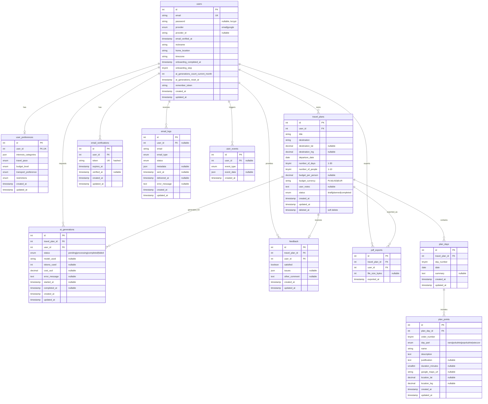

# VibeTravels Database Schema

## Entity Relationship Diagram



## Table Details

### Core Authentication

#### users
**Purpose**: Multi-provider user authentication and profile management

**Key Constraints**:
- `email` UNIQUE
- `(provider, provider_id)` composite index (allows account merging)

**Critical Columns**:
- `ai_generations_count_current_month`: Tracks 10/month limit
- `ai_generations_reset_at`: Next reset date (first day of month)
- `onboarding_step`: Progress tracking (0=not started, 4=completed)

**Cascade Delete**: When user deleted → ALL related data deleted (GDPR compliance)

---

### Travel Planning

#### travel_plans
**Purpose**: User travel plans with metadata

**Status Workflow**:
```
draft (saved without AI)
  ↓ (user clicks "Generate Plan")
planned (AI generated itinerary)
  ↓ (after departure_date + number_of_days)
completed (trip finished)
```

**Constraints**:
- `number_of_days` CHECK BETWEEN 1 AND 30
- `number_of_people` CHECK BETWEEN 1 AND 10
- `budget_currency` CHECK IN ('PLN', 'USD', 'EUR')

**Soft Delete**: Uses `deleted_at` column (user can recover)

#### plan_days
**Purpose**: Individual days within itinerary

**Unique Constraint**: `(travel_plan_id, day_number)`
- Prevents duplicate day numbers
- day_number sequence: 1, 2, 3, ..., up to 30

#### plan_points
**Purpose**: Sightseeing points/activities within each day

**Unique Constraint**: `(plan_day_id, order_number)`
- Ensures ordered list within day
- order_number sequence: 1, 2, 3, ...

**Day Part Organization**:
- `rano` (morning): 6:00-12:00
- `poludnie` (midday): 12:00-15:00
- `popoludnie` (afternoon): 15:00-18:00
- `wieczor` (evening): 18:00-23:00

---

### AI Integration

#### ai_generations
**Purpose**: Complete audit trail of AI generation attempts

**Status Workflow**:
```
pending (job queued)
  ↓
processing (AI request in progress)
  ↓
completed (success) OR failed (error)
```

**Cost Tracking**:
- `tokens_used`: Total tokens (prompt + completion)
- `cost_usd`: DECIMAL(10,4) for precise cost tracking
- Example: GPT-4o-mini ~$0.0234 per plan

**Limit Logic**:
- Only `status='completed'` counts toward monthly limit
- Failed generations don't consume user's limit (rollback)

**Regeneration**: Each regeneration creates NEW record (history preserved)

---

### User Feedback & Analytics

#### feedback
**Purpose**: Collect user satisfaction feedback

**Unique Constraint**: `(travel_plan_id, user_id)`
- One feedback per user per plan
- After regeneration, user can provide new feedback (replaces old)

**Issue Categories** (JSON array):
```json
["za_malo_szczegolow", "nie_pasuje_do_preferencji", "slaba_kolejnosc", "inne"]
```

#### user_events
**Purpose**: Behavioral analytics for product insights

**Event Types**:
- `login`, `logout`: Session tracking
- `onboarding_completed`: Conversion funnel
- `plan_created`, `plan_saved_as_draft`: Engagement
- `ai_generated`, `ai_regenerated`: AI usage patterns
- `pdf_exported`: Value indicator
- `feedback_submitted`: Satisfaction tracking

**Privacy**: No IP address or user agent in MVP

---

### Email System

#### email_verifications
**Purpose**: Email verification with 24h expiry

**Security**:
- Token hashed (SHA256/bcrypt) before storage
- Plain token only in email URL
- Verification process:
  1. Generate random token
  2. Hash and store in DB with expiry
  3. Send plain token in email
  4. User clicks → hash received token → match against DB

#### email_logs
**Purpose**: Audit trail for all outbound emails

**Status Workflow**:
```
queued (pending)
  ↓
sent (passed to Mailgun)
  ↓ (optional webhook in production)
delivered OR failed/bounced
```

**Rate Limiting Support**:
```sql
-- Check if user sent verification email in last 5 minutes
SELECT COUNT(*) FROM email_logs
WHERE user_id = ?
  AND email_type = 'verification'
  AND sent_at > NOW() - INTERVAL 5 MINUTE;
```

---

### Queue System

#### jobs
**Purpose**: Laravel queue for async processing

**Queue Names**:
- `default`: Standard priority
- `high`: AI generation (user waiting for result)
- `low`: Background tasks

**Driver Options**:
- Development: `database` (simple, no Redis required)
- Production: `redis` (recommended, faster)

#### failed_jobs
**Purpose**: Permanently failed jobs for debugging

**Retry Command**:
```bash
php artisan queue:retry {uuid}
```

## Indexes Summary

### Performance-Critical Indexes

| Table | Index | Purpose |
|-------|-------|---------|
| users | `email` (unique) | Login lookup |
| users | `(provider, provider_id)` | OAuth account matching |
| travel_plans | `user_id` | User's plans list |
| travel_plans | `status` | Quick filters (drafts/planned/completed) |
| travel_plans | `created_at` | Sorting (newest first) |
| plan_days | `(travel_plan_id, day_number)` | Day retrieval + uniqueness |
| plan_points | `(plan_day_id, order_number)` | Point retrieval + uniqueness |
| ai_generations | `(user_id, created_at)` | Limit counting this month |
| email_logs | `(user_id, email_type, sent_at)` | Rate limiting queries |
| user_events | `(user_id, created_at)` | User activity timeline |
| user_events | `(event_type, created_at)` | Event type analytics |

## Data Types Reference

### MySQL Types Used

| Laravel Blueprint | MySQL Type | Use Case |
|-------------------|------------|----------|
| `id()` | INT UNSIGNED AUTO_INCREMENT | Primary keys |
| `string(N)` | VARCHAR(N) | Text fields (email, names, URLs) |
| `text()` | TEXT | Long text (descriptions, notes, errors) |
| `longText()` | LONGTEXT | Very long text (job payloads) |
| `boolean()` | TINYINT(1) | True/false flags |
| `tinyInteger()` | TINYINT | Small numbers (1-255) |
| `smallInteger()` | SMALLINT | Medium numbers (-32K to 32K) |
| `integer()` | INT | Regular numbers |
| `unsignedInteger()` | INT UNSIGNED | Positive integers (foreign keys) |
| `decimal(M,D)` | DECIMAL(M,D) | Precise decimals (money, coordinates) |
| `date()` | DATE | Calendar dates (no time) |
| `timestamp()` | TIMESTAMP | Date + time (UTC) |
| `json()` | JSON | Structured data (validated by MySQL) |
| `enum([...])` | ENUM(...) | Fixed set of values |

### JSON Column Examples

**user_preferences.interests_categories**:
```json
["historia_kultura", "przyroda_outdoor", "gastronomia"]
```

**feedback.issues**:
```json
["za_malo_szczegolow", "slaba_kolejnosc"]
```

**user_events.event_data**:
```json
{
  "travel_plan_id": 123,
  "ai_generation_id": 456,
  "tokens_used": 1500,
  "cost_usd": 0.0234
}
```

**email_logs.metadata**:
```json
{
  "plan_title": "Summer in Rome",
  "destination": "Rome, Italy",
  "departure_date": "2025-07-15"
}
```

## Foreign Key Cascade Rules

All foreign keys use **ON DELETE CASCADE** for automatic cleanup:

```sql
-- Example: Deleting user cascades to all related data
DELETE FROM users WHERE id = 123;

-- Automatically deletes:
-- - user_preferences (1 record)
-- - travel_plans (N records)
--   - plan_days (N × M records)
--     - plan_points (N × M × K records)
--   - ai_generations (N × X records)
--   - feedback (N records)
--   - pdf_exports (N × Y records)
-- - email_verifications (N records)
-- - email_logs (N records)
-- - user_events (N records)
```

**GDPR Compliance**: This implements the "right to be forgotten" - one DELETE operation removes all user data.

## Character Set & Collation

**Global Settings** (from `config/database.php`):
```php
'charset' => 'utf8mb4',
'collation' => 'utf8mb4_unicode_ci',
```

**Why utf8mb4?**
- Supports full Unicode (including emoji: 🗺️, 🏖️, ⛰️)
- Required for international destination names
- Compatible with all modern applications

**Why utf8mb4_unicode_ci?**
- Case-insensitive (`rome` = `ROME` = `Rome`)
- Better international character sorting than `utf8mb4_general_ci`
- Handles accents correctly (e.g., `café` vs `cafe`)

## Storage Estimates (MVP Scale)

Based on 500 users, 3 plans/user/year:

| Table | Avg Row Size | Rows (Year 1) | Total Size |
|-------|--------------|---------------|------------|
| users | 500 bytes | 500 | 250 KB |
| user_preferences | 300 bytes | 500 | 150 KB |
| travel_plans | 800 bytes | 1,500 | 1.2 MB |
| plan_days | 200 bytes | 10,500 | 2.1 MB |
| plan_points | 400 bytes | 63,000 | 25 MB |
| ai_generations | 300 bytes | 1,800 | 540 KB |
| feedback | 200 bytes | 1,000 | 200 KB |
| pdf_exports | 100 bytes | 600 | 60 KB |
| email_verifications | 150 bytes | 1,000 | 150 KB |
| email_logs | 250 bytes | 10,000 | 2.5 MB |
| user_events | 200 bytes | 25,000 | 5 MB |
| **TOTAL** | | | **~37 MB** |

**Note**: Indexes add ~30% overhead → **~50 MB total** for Year 1 MVP

## Query Patterns

### Common Queries

**User's travel plans (newest first)**:
```sql
SELECT * FROM travel_plans
WHERE user_id = ? AND deleted_at IS NULL
ORDER BY created_at DESC;
```
- Uses index: `idx_travel_plans_user_id` + `idx_travel_plans_created_at`

**Plan with full itinerary**:
```sql
-- Step 1: Get plan
SELECT * FROM travel_plans WHERE id = ?;

-- Step 2: Get days
SELECT * FROM plan_days
WHERE travel_plan_id = ?
ORDER BY day_number;

-- Step 3: Get points for each day
SELECT * FROM plan_points
WHERE plan_day_id IN (?, ?, ...)
ORDER BY plan_day_id, order_number;
```
- Uses indexes: `idx_plan_days_plan_day`, `idx_plan_points_day_order`

**User's AI generation count this month**:
```sql
SELECT COUNT(*) FROM ai_generations
WHERE user_id = ?
  AND status = 'completed'
  AND MONTH(created_at) = MONTH(NOW())
  AND YEAR(created_at) = YEAR(NOW());
```
- Uses index: `idx_ai_generations_user_created`

**Recent verification emails for rate limiting**:
```sql
SELECT COUNT(*) FROM email_logs
WHERE user_id = ?
  AND email_type = 'verification'
  AND sent_at > NOW() - INTERVAL 5 MINUTE;
```
- Uses index: `idx_email_logs_user_type_sent`

## Maintenance Scripts

### Monthly Reset of AI Limits

**Cron job** (runs 1st day of month at 00:01):
```sql
UPDATE users
SET ai_generations_count_current_month = 0,
    ai_generations_reset_at = NULL
WHERE ai_generations_count_current_month > 0;
```

### Cleanup Expired Verification Tokens

**Cron job** (runs daily):
```sql
DELETE FROM email_verifications
WHERE expires_at < NOW()
  AND verified_at IS NULL;
```

### Auto-Complete Old Trips

**Cron job** (runs daily):
```sql
UPDATE travel_plans
SET status = 'completed'
WHERE status = 'planned'
  AND DATE_ADD(departure_date, INTERVAL number_of_days DAY) < CURDATE();
```

## Version History

| Version | Date | Changes |
|---------|------|---------|
| 1.0.0 | 2025-10-08 | Initial MVP schema - 14 tables created |

---

**Last Updated**: 2025-10-08
**Total Tables**: 14
**Total Indexes**: 24
**MySQL Version**: 8.0.16+
